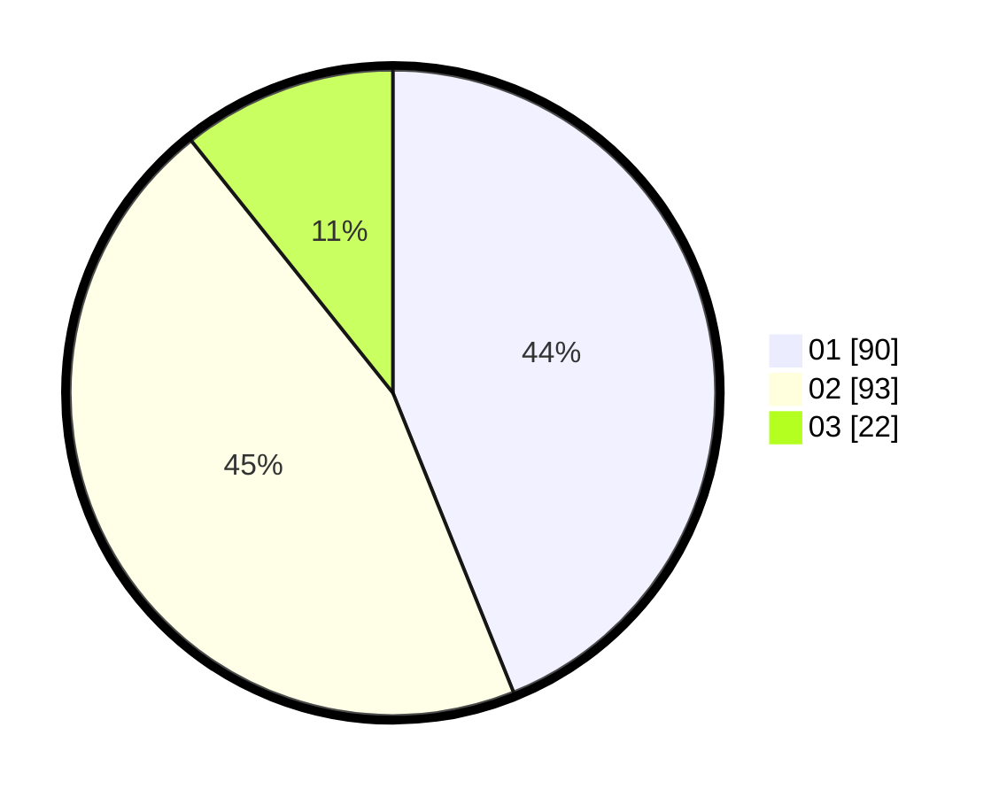

# Hasil

Hasil perolehan suara paslon dapat dilihat pada file paslon-01.txt, paslon-02.txt, dan paslon-03.txt.

Jika tidak ada, artinya data tersebut belum ada pada SIREKAP.

## Perolehan Suara

 * Paslon 01: **90**.
 * Paslon 02: **93**.
 * Paslon 03: **22**.

## Foto C Plano

https://sirekap-obj-formc.kpu.go.id/9b22/pemilu/ppwp/31/73/06/10/05/3173061005011-20240214-224102--4342c7c6-0edf-498d-ad96-1d1d25a6c928.jpg

https://sirekap-obj-formc.kpu.go.id/9b22/pemilu/ppwp/31/73/06/10/05/3173061005011-20240214-224218--baa0da18-6ef5-4b0a-afbc-1dfd56ed9455.jpg

https://sirekap-obj-formc.kpu.go.id/9b22/pemilu/ppwp/31/73/06/10/05/3173061005011-20240214-224327--5c5ea392-cb79-4fa4-b7df-11f4b74e454d.jpg
