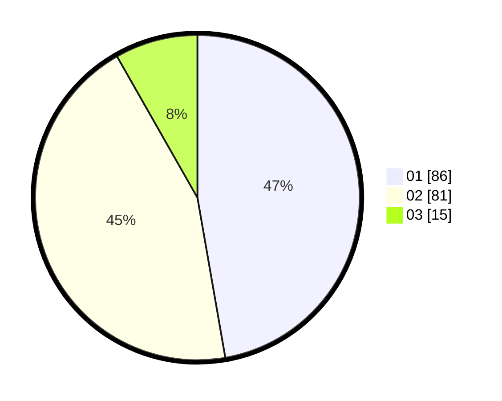

# Hasil

Hasil perolehan suara paslon dapat dilihat pada file paslon-01.txt, paslon-02.txt, dan paslon-03.txt.

Jika tidak ada, artinya data tersebut belum ada pada SIREKAP.

## Perolehan Suara

 * Paslon 01: **86**.
 * Paslon 02: **81**.
 * Paslon 03: **15**.

## Foto C Plano

https://sirekap-obj-formc.kpu.go.id/e3ab/pemilu/ppwp/31/73/06/10/05/3173061005021-20240214-200322--78f8cd59-9545-4fa5-aa95-45be3e0e335e.jpg

https://sirekap-obj-formc.kpu.go.id/e3ab/pemilu/ppwp/31/73/06/10/05/3173061005021-20240214-200419--63953636-2aa8-419c-9e2a-5d4e8bb9661a.jpg

https://sirekap-obj-formc.kpu.go.id/e3ab/pemilu/ppwp/31/73/06/10/05/3173061005021-20240214-210942--67536b91-e46e-4402-90c2-adda5f8c6b47.jpg

## DATA PEMILIH TETAP

Jumlah pemilih dalam DPT: **186**.
 * L: **99**.
 * P: **87**.

## DATA PENGGUNA HAK PILIH

Jumlah pengguna hak pilih dalam DPT: **186**.
 * L: **99**.
 * P: **87**.

Jumlah pengguna hak pilih dalam DPTb: **0**.
 * L: **0**.
 * P: **0**.

Jumlah pengguna hak pilih dalam DPK: **0**.
 * L: **0**.
 * P: **0**.

Jumlah pengguna hak pilih: **186**.
 * L: **99**.
 * P: **87**.

## JUMLAH SUARA SAH DAN TIDAK SAH

JUMLAH SELURUH SUARA SAH: **182**.

JUMLAH SUARA TIDAK SAH: **4**.

JUMLAH SELURUH SUARA SAH DAN SUARA TIDAK SAH: **186**.
