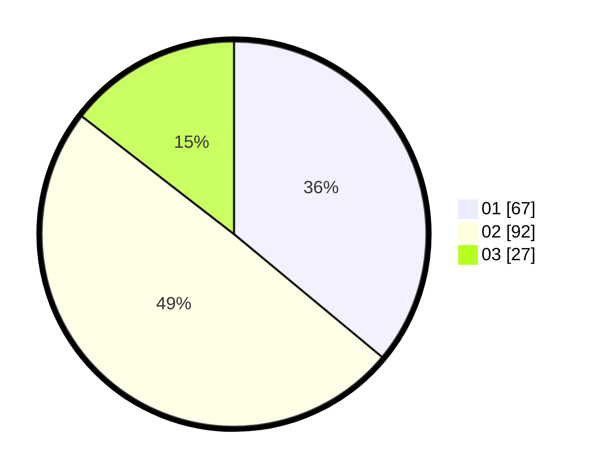

# Hasil

Hasil perolehan suara paslon dapat dilihat pada file paslon-01.txt, paslon-02.txt, dan paslon-03.txt.

Jika tidak ada, artinya data tersebut belum ada pada SIREKAP.

## Perolehan Suara

 * Paslon 01: **67**.
 * Paslon 02: **92**.
 * Paslon 03: **27**.

## Foto C Plano

https://sirekap-obj-formc.kpu.go.id/73bc/pemilu/ppwp/31/73/06/10/05/3173061005023-20240217-010411--187b2ff7-c659-44c1-970d-e10b7669efed.jpg

https://sirekap-obj-formc.kpu.go.id/73bc/pemilu/ppwp/31/73/06/10/05/3173061005023-20240214-202942--9721478c-4e08-4338-a87e-17e9f41f0dc2.jpg

https://sirekap-obj-formc.kpu.go.id/73bc/pemilu/ppwp/31/73/06/10/05/3173061005023-20240214-203145--3d056ccf-b808-4afc-8887-786eb77e0cb6.jpg

## DATA PEMILIH TETAP

Jumlah pemilih dalam DPT: **241**.
 * L: **120**.
 * P: **121**.

## DATA PENGGUNA HAK PILIH

Jumlah pengguna hak pilih dalam DPT: **186**.
 * L: **91**.
 * P: **95**.

Jumlah pengguna hak pilih dalam DPTb: **1**.
 * L: **0**.
 * P: **1**.

Jumlah pengguna hak pilih dalam DPK: **0**.
 * L: **0**.
 * P: **0**.

Jumlah pengguna hak pilih: **187**.
 * L: **91**.
 * P: **96**.

## JUMLAH SUARA SAH DAN TIDAK SAH

JUMLAH SELURUH SUARA SAH: **186**.

JUMLAH SUARA TIDAK SAH: **1**.

JUMLAH SELURUH SUARA SAH DAN SUARA TIDAK SAH: **187**.
