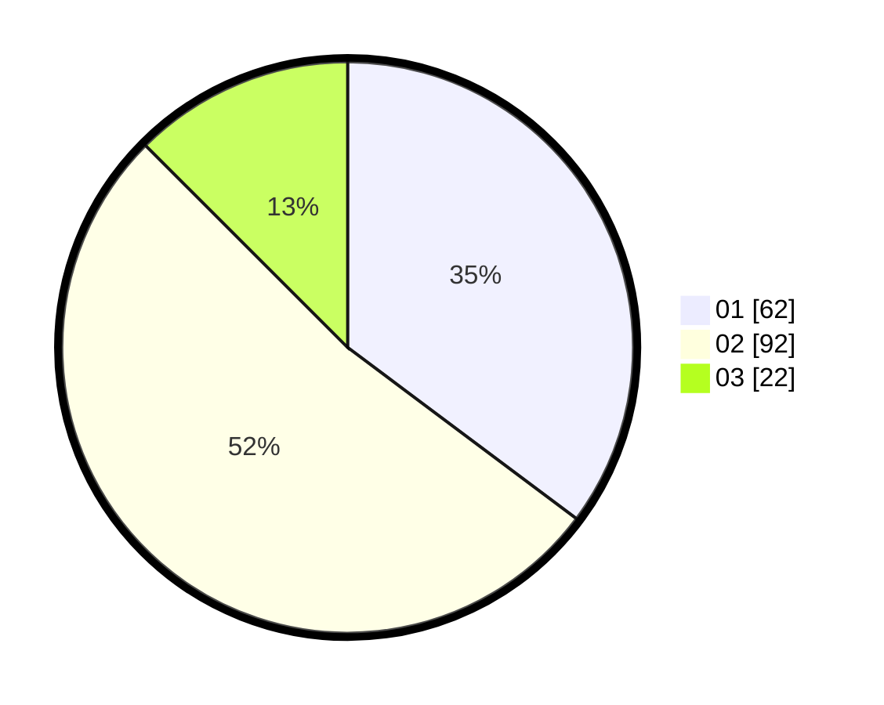

# Hasil

Hasil perolehan suara paslon dapat dilihat pada file paslon-01.txt, paslon-02.txt, dan paslon-03.txt.

Jika tidak ada, artinya data tersebut belum ada pada SIREKAP.

## Perolehan Suara

 * Paslon 01: **62**.
 * Paslon 02: **92**.
 * Paslon 03: **22**.

## Foto C Plano

https://sirekap-obj-formc.kpu.go.id/f9e1/pemilu/ppwp/31/73/06/10/05/3173061005025-20240216-213755--d33c00cc-5bfc-4c76-9367-c3447d71613a.jpg

https://sirekap-obj-formc.kpu.go.id/f9e1/pemilu/ppwp/31/73/06/10/05/3173061005025-20240216-213756--50459c32-8e8b-4b8a-8ef9-dc3eeb9932ab.jpg

https://sirekap-obj-formc.kpu.go.id/f9e1/pemilu/ppwp/31/73/06/10/05/3173061005025-20240216-213756--9a7b59bf-2686-4484-8ec2-b98888d89d92.jpg

## DATA PEMILIH TETAP

Jumlah pemilih dalam DPT: **215**.
 * L: **113**.
 * P: **102**.

## DATA PENGGUNA HAK PILIH

Jumlah pengguna hak pilih dalam DPT: **179**.
 * L: **92**.
 * P: **87**.

Jumlah pengguna hak pilih dalam DPTb: **0**.
 * L: **0**.
 * P: **0**.

Jumlah pengguna hak pilih dalam DPK: **0**.
 * L: **0**.
 * P: **0**.

Jumlah pengguna hak pilih: **0**.
 * L: **0**.
 * P: **0**.

## JUMLAH SUARA SAH DAN TIDAK SAH

JUMLAH SELURUH SUARA SAH: **176**.

JUMLAH SUARA TIDAK SAH: **3**.

JUMLAH SELURUH SUARA SAH DAN SUARA TIDAK SAH: **179**.
