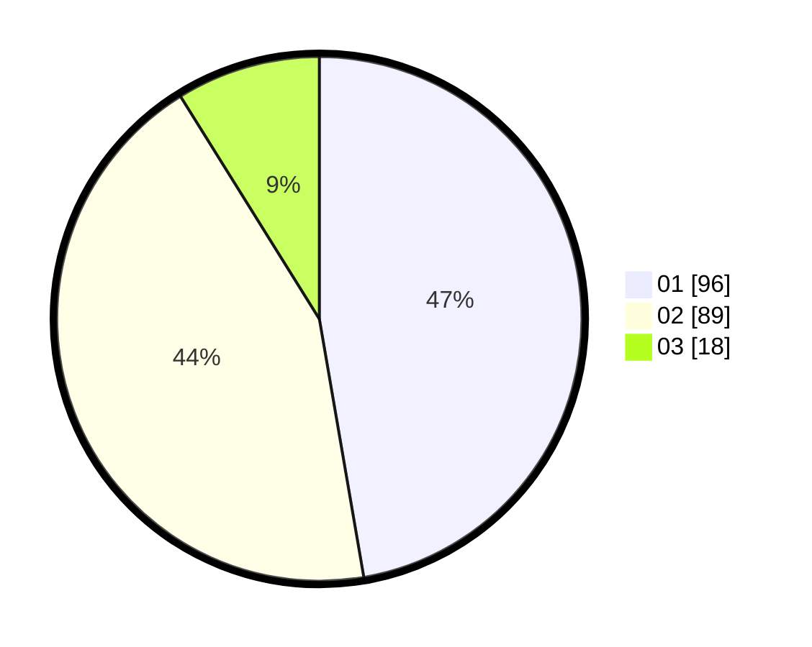

# Hasil

Hasil perolehan suara paslon dapat dilihat pada file paslon-01.txt, paslon-02.txt, dan paslon-03.txt.

Jika tidak ada, artinya data tersebut belum ada pada SIREKAP.

## Perolehan Suara

 * Paslon 01: **96**.
 * Paslon 02: **89**.
 * Paslon 03: **18**.

## Foto C Plano

https://sirekap-obj-formc.kpu.go.id/6f6f/pemilu/ppwp/31/73/06/10/05/3173061005029-20240215-004945--d50ccdef-6286-49db-a93d-95a3849231f4.jpg

https://sirekap-obj-formc.kpu.go.id/6f6f/pemilu/ppwp/31/73/06/10/05/3173061005029-20240215-004844--0e4f55f9-c972-41d6-a1d8-4e8a847adf95.jpg

https://sirekap-obj-formc.kpu.go.id/6f6f/pemilu/ppwp/31/73/06/10/05/3173061005029-20240215-004754--759c9e49-6bc3-48f5-9ffb-51db7eedc2f6.jpg
