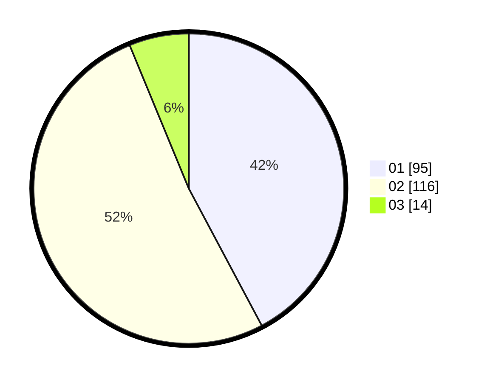

# Hasil

Hasil perolehan suara paslon dapat dilihat pada file paslon-01.txt, paslon-02.txt, dan paslon-03.txt.

Jika tidak ada, artinya data tersebut belum ada pada SIREKAP.

## Perolehan Suara

 * Paslon 01: **95**.
 * Paslon 02: **116**.
 * Paslon 03: **14**.

## Foto C Plano

https://sirekap-obj-formc.kpu.go.id/963e/pemilu/ppwp/31/73/06/10/05/3173061005034-20240214-230722--8b23650c-b53c-4e52-8ccd-9fb664aa249a.jpg

https://sirekap-obj-formc.kpu.go.id/963e/pemilu/ppwp/31/73/06/10/05/3173061005034-20240214-230756--32e2029f-463b-4db4-a93b-e8f053a4ed70.jpg

https://sirekap-obj-formc.kpu.go.id/963e/pemilu/ppwp/31/73/06/10/05/3173061005034-20240214-230845--f7cbf459-e5d1-4ca1-afd1-3dc38b100088.jpg

## DATA PEMILIH TETAP

Jumlah pemilih dalam DPT: **277**.
 * L: **128**.
 * P: **149**.

## DATA PENGGUNA HAK PILIH

Jumlah pengguna hak pilih dalam DPT: **225**.
 * L: **100**.
 * P: **125**.

Jumlah pengguna hak pilih dalam DPTb: **0**.
 * L: **0**.
 * P: **0**.

Jumlah pengguna hak pilih dalam DPK: **0**.
 * L: **0**.
 * P: **0**.

Jumlah pengguna hak pilih: **225**.
 * L: **100**.
 * P: **125**.

## JUMLAH SUARA SAH DAN TIDAK SAH

JUMLAH SELURUH SUARA SAH: **225**.

JUMLAH SUARA TIDAK SAH: **0**.

JUMLAH SELURUH SUARA SAH DAN SUARA TIDAK SAH: **225**.
