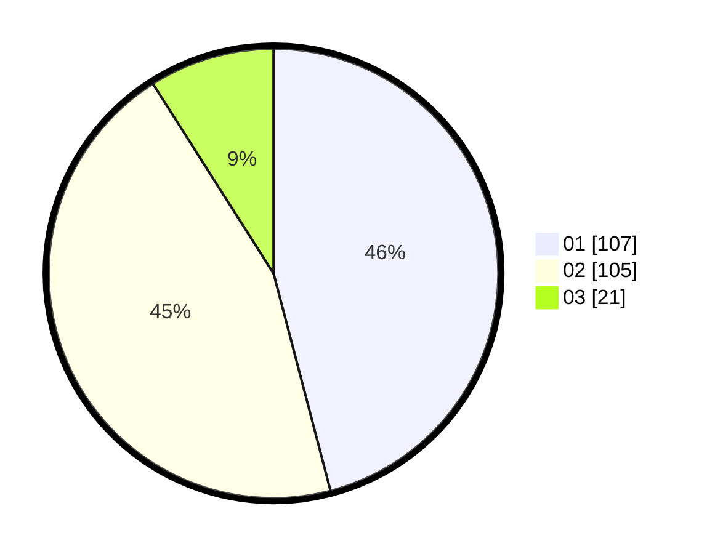

# Hasil

Hasil perolehan suara paslon dapat dilihat pada file paslon-01.txt, paslon-02.txt, dan paslon-03.txt.

Jika tidak ada, artinya data tersebut belum ada pada SIREKAP.

## Perolehan Suara

 * Paslon 01: **107**.
 * Paslon 02: **105**.
 * Paslon 03: **21**.

## Foto C Plano

https://sirekap-obj-formc.kpu.go.id/93b3/pemilu/ppwp/31/73/06/10/05/3173061005035-20240214-193731--d18da77b-26bf-4c72-b642-cb4c99ce33f5.jpg

https://sirekap-obj-formc.kpu.go.id/93b3/pemilu/ppwp/31/73/06/10/05/3173061005035-20240214-231035--77854c64-9836-4b70-90c6-ce9410aade03.jpg

https://sirekap-obj-formc.kpu.go.id/93b3/pemilu/ppwp/31/73/06/10/05/3173061005035-20240214-193823--ec09255f-8477-49d3-9fb7-6fc132e5c127.jpg

## DATA PEMILIH TETAP

Jumlah pemilih dalam DPT: **271**.
 * L: **134**.
 * P: **137**.

## DATA PENGGUNA HAK PILIH

Jumlah pengguna hak pilih dalam DPT: **224**.
 * L: **108**.
 * P: **116**.

Jumlah pengguna hak pilih dalam DPTb: **2**.
 * L: **0**.
 * P: **2**.

Jumlah pengguna hak pilih dalam DPK: **8**.
 * L: **2**.
 * P: **6**.

Jumlah pengguna hak pilih: **234**.
 * L: **110**.
 * P: **124**.

## JUMLAH SUARA SAH DAN TIDAK SAH

JUMLAH SELURUH SUARA SAH: **233**.

JUMLAH SUARA TIDAK SAH: **1**.

JUMLAH SELURUH SUARA SAH DAN SUARA TIDAK SAH: **234**.
