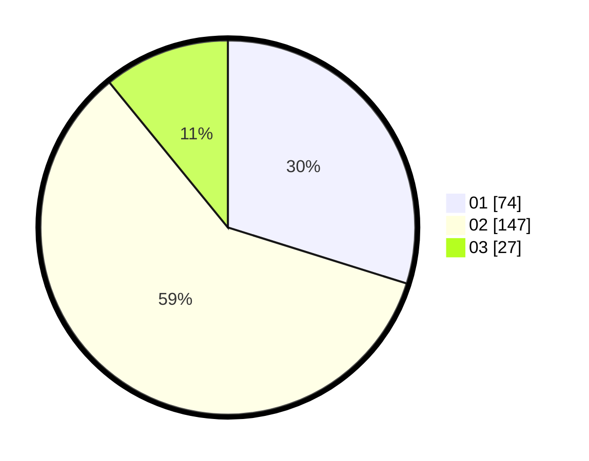

# Hasil

Hasil perolehan suara paslon dapat dilihat pada file paslon-01.txt, paslon-02.txt, dan paslon-03.txt.

Jika tidak ada, artinya data tersebut belum ada pada SIREKAP.

## Perolehan Suara

 * Paslon 01: **74**.
 * Paslon 02: **147**.
 * Paslon 03: **27**.

## Foto C Plano

https://sirekap-obj-formc.kpu.go.id/433b/pemilu/ppwp/31/73/06/10/05/3173061005037-20240214-231303--0ad6b978-8237-4349-bf78-bd897a3e8cce.jpg

https://sirekap-obj-formc.kpu.go.id/433b/pemilu/ppwp/31/73/06/10/05/3173061005037-20240214-225324--9124d840-44a5-464c-b708-dae52cea1d8c.jpg

https://sirekap-obj-formc.kpu.go.id/433b/pemilu/ppwp/31/73/06/10/05/3173061005037-20240214-225358--63943036-e560-4f2f-8322-f8746cc69f82.jpg
