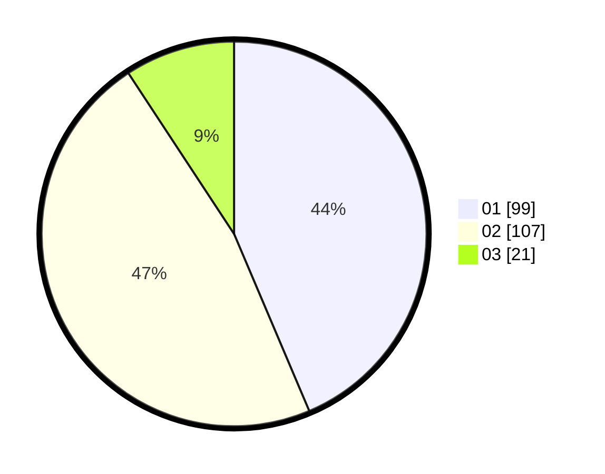

# Hasil

Hasil perolehan suara paslon dapat dilihat pada file paslon-01.txt, paslon-02.txt, dan paslon-03.txt.

Jika tidak ada, artinya data tersebut belum ada pada SIREKAP.

## Perolehan Suara

 * Paslon 01: **99**.
 * Paslon 02: **107**.
 * Paslon 03: **21**.

## Foto C Plano

https://sirekap-obj-formc.kpu.go.id/7a49/pemilu/ppwp/31/73/06/10/05/3173061005039-20240214-224504--a51b1ac4-6deb-42d8-b1dc-558c03a0f7a2.jpg

https://sirekap-obj-formc.kpu.go.id/7a49/pemilu/ppwp/31/73/06/10/05/3173061005039-20240214-224605--fd4f3cdf-2e7a-4dab-ab7e-496d553878ff.jpg

https://sirekap-obj-formc.kpu.go.id/7a49/pemilu/ppwp/31/73/06/10/05/3173061005039-20240214-224648--f5f973d7-ebaf-4a11-a43b-9d8ef3ec945d.jpg

## DATA PEMILIH TETAP

Jumlah pemilih dalam DPT: **277**.
 * L: **132**.
 * P: **145**.

## DATA PENGGUNA HAK PILIH

Jumlah pengguna hak pilih dalam DPT: **226**.
 * L: **103**.
 * P: **123**.

Jumlah pengguna hak pilih dalam DPTb: **1**.
 * L: **1**.
 * P: **0**.

Jumlah pengguna hak pilih dalam DPK: **4**.
 * L: **1**.
 * P: **3**.

Jumlah pengguna hak pilih: **231**.
 * L: **105**.
 * P: **126**.

## JUMLAH SUARA SAH DAN TIDAK SAH

JUMLAH SELURUH SUARA SAH: **227**.

JUMLAH SUARA TIDAK SAH: **4**.

JUMLAH SELURUH SUARA SAH DAN SUARA TIDAK SAH: **231**.
