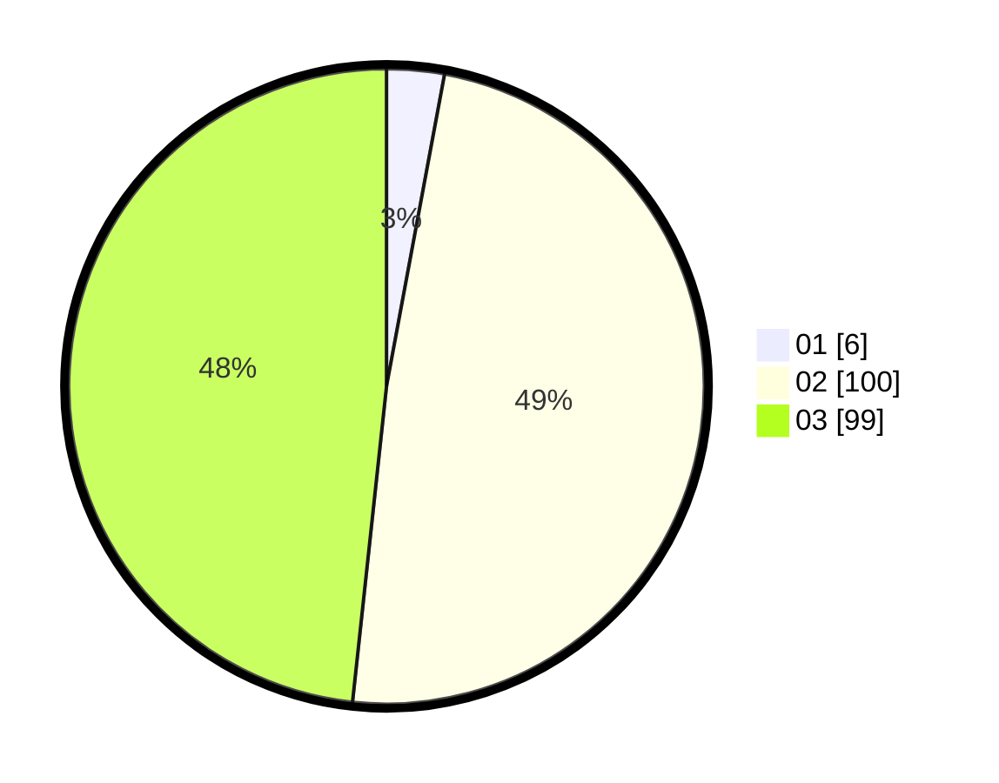

# Hasil

Hasil perolehan suara paslon dapat dilihat pada file paslon-01.txt, paslon-02.txt, dan paslon-03.txt.

Jika tidak ada, artinya data tersebut belum ada pada SIREKAP.

## Perolehan Suara

 * Paslon 01: **6**.
 * Paslon 02: **100**.
 * Paslon 03: **99**.

## Foto C Plano

https://sirekap-obj-formc.kpu.go.id/fbdf/pemilu/ppwp/31/73/06/10/05/3173061005041-20240214-212828--b6d0bed7-de22-46db-b710-fadd11b74f73.jpg

https://sirekap-obj-formc.kpu.go.id/fbdf/pemilu/ppwp/31/73/06/10/05/3173061005041-20240214-204931--3a6dab75-f142-4a01-8ed4-845f7c739915.jpg

https://sirekap-obj-formc.kpu.go.id/fbdf/pemilu/ppwp/31/73/06/10/05/3173061005041-20240214-205000--2e32710b-790e-4038-adbd-a890419a9a4c.jpg
