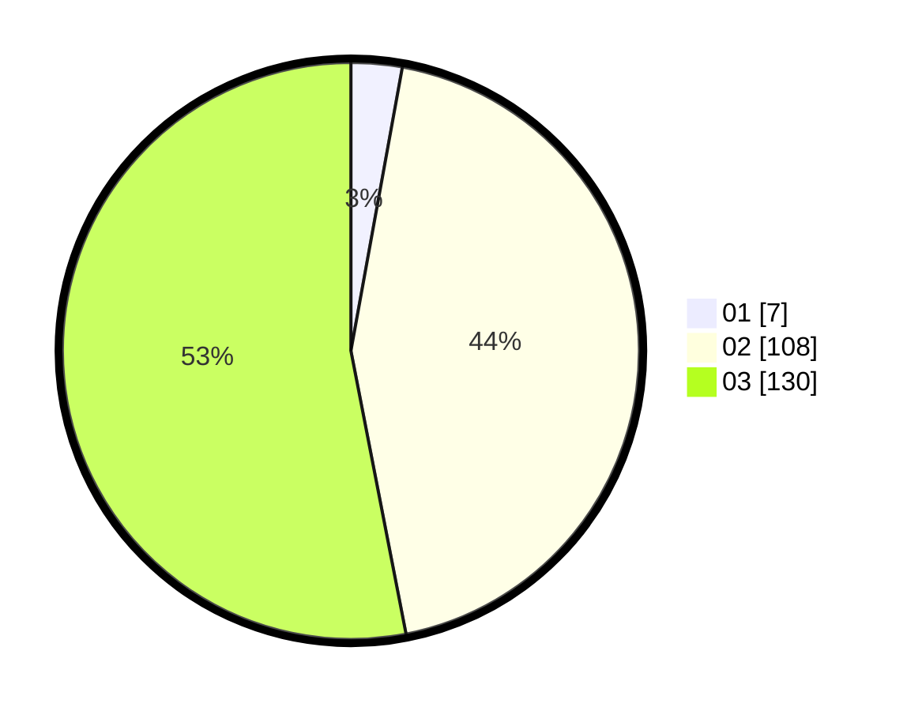

# Hasil

Hasil perolehan suara paslon dapat dilihat pada file paslon-01.txt, paslon-02.txt, dan paslon-03.txt.

Jika tidak ada, artinya data tersebut belum ada pada SIREKAP.

## Perolehan Suara

 * Paslon 01: **7**.
 * Paslon 02: **108**.
 * Paslon 03: **130**.

## Foto C Plano

https://sirekap-obj-formc.kpu.go.id/030b/pemilu/ppwp/31/73/06/10/05/3173061005044-20240214-223309--7a71a155-83a4-453e-8182-facd5654dea9.jpg

https://sirekap-obj-formc.kpu.go.id/030b/pemilu/ppwp/31/73/06/10/05/3173061005044-20240214-223918--236d4786-36ce-4a9f-8591-df49a9b87a75.jpg

https://sirekap-obj-formc.kpu.go.id/030b/pemilu/ppwp/31/73/06/10/05/3173061005044-20240214-223817--9f3ccf56-73ce-4071-8918-884fe89252af.jpg

## DATA PEMILIH TETAP

Jumlah pemilih dalam DPT: **294**.
 * L: **145**.
 * P: **149**.

## DATA PENGGUNA HAK PILIH

Jumlah pengguna hak pilih dalam DPT: **234**.
 * L: **115**.
 * P: **119**.

Jumlah pengguna hak pilih dalam DPTb: **5**.
 * L: **1**.
 * P: **4**.

Jumlah pengguna hak pilih dalam DPK: **8**.
 * L: **5**.
 * P: **3**.

Jumlah pengguna hak pilih: **247**.
 * L: **121**.
 * P: **126**.

## JUMLAH SUARA SAH DAN TIDAK SAH

JUMLAH SELURUH SUARA SAH: **245**.

JUMLAH SUARA TIDAK SAH: **2**.

JUMLAH SELURUH SUARA SAH DAN SUARA TIDAK SAH: **247**.
