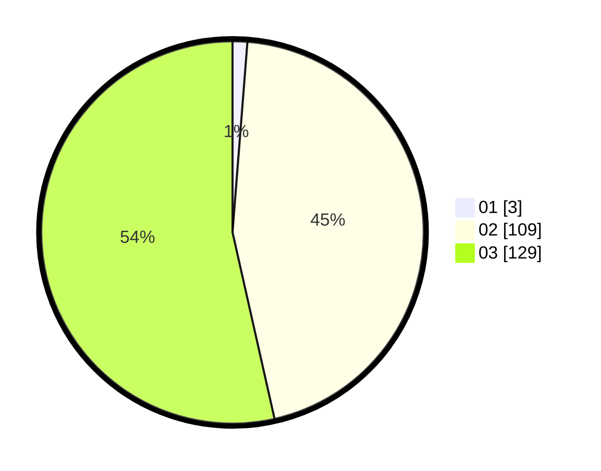

# Hasil

Hasil perolehan suara paslon dapat dilihat pada file paslon-01.txt, paslon-02.txt, dan paslon-03.txt.

Jika tidak ada, artinya data tersebut belum ada pada SIREKAP.

## Perolehan Suara

 * Paslon 01: **3**.
 * Paslon 02: **109**.
 * Paslon 03: **129**.

## Foto C Plano

https://sirekap-obj-formc.kpu.go.id/ac14/pemilu/ppwp/31/73/06/10/05/3173061005045-20240214-203821--60d4d1fe-6408-4a2c-aaf1-f64560636bab.jpg

https://sirekap-obj-formc.kpu.go.id/ac14/pemilu/ppwp/31/73/06/10/05/3173061005045-20240214-203841--ce282bce-358e-4064-9e19-d8749d791580.jpg

https://sirekap-obj-formc.kpu.go.id/ac14/pemilu/ppwp/31/73/06/10/05/3173061005045-20240214-203916--1dabb6b5-5a53-4483-9580-bc8f22fdad62.jpg
