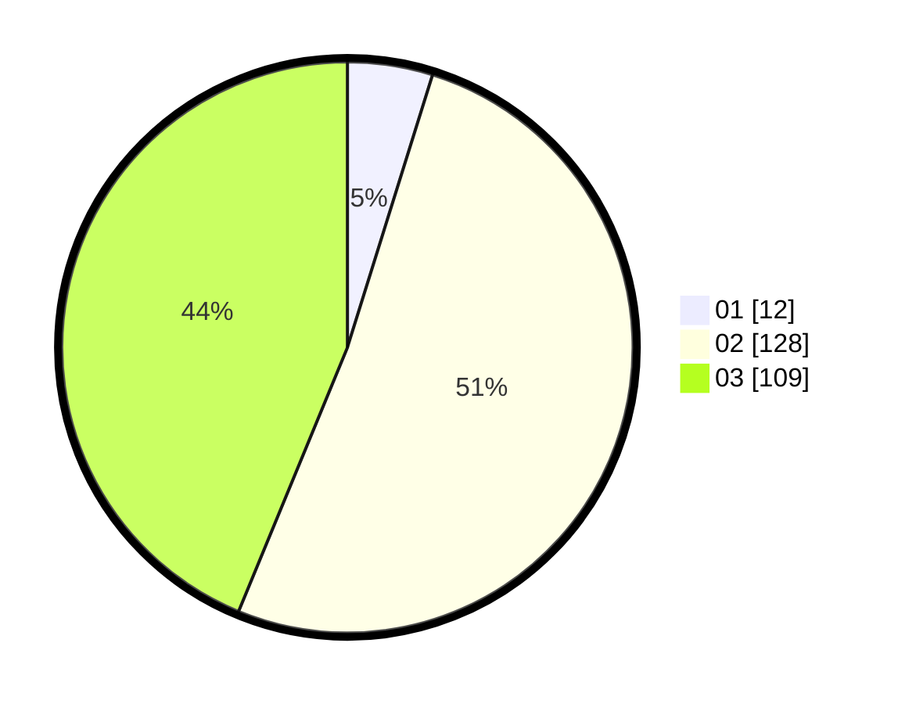

# Hasil

Hasil perolehan suara paslon dapat dilihat pada file paslon-01.txt, paslon-02.txt, dan paslon-03.txt.

Jika tidak ada, artinya data tersebut belum ada pada SIREKAP.

## Perolehan Suara

 * Paslon 01: **12**.
 * Paslon 02: **128**.
 * Paslon 03: **109**.

## Foto C Plano

https://sirekap-obj-formc.kpu.go.id/a70e/pemilu/ppwp/31/73/06/10/05/3173061005048-20240214-201525--ca66e764-c4d9-4d5b-8109-b554ae8b6977.jpg

https://sirekap-obj-formc.kpu.go.id/a70e/pemilu/ppwp/31/73/06/10/05/3173061005048-20240214-201536--27d65ec3-2f64-4117-97ee-938bf14e6d55.jpg

https://sirekap-obj-formc.kpu.go.id/a70e/pemilu/ppwp/31/73/06/10/05/3173061005048-20240214-201544--e7d08b8b-09d2-4f08-98e8-e802e77f4688.jpg

## DATA PEMILIH TETAP

Jumlah pemilih dalam DPT: **292**.
 * L: **145**.
 * P: **147**.

## DATA PENGGUNA HAK PILIH

Jumlah pengguna hak pilih dalam DPT: **235**.
 * L: **120**.
 * P: **115**.

Jumlah pengguna hak pilih dalam DPTb: **6**.
 * L: **0**.
 * P: **6**.

Jumlah pengguna hak pilih dalam DPK: **8**.
 * L: **2**.
 * P: **6**.

Jumlah pengguna hak pilih: **249**.
 * L: **122**.
 * P: **127**.

## JUMLAH SUARA SAH DAN TIDAK SAH

JUMLAH SELURUH SUARA SAH: **249**.

JUMLAH SUARA TIDAK SAH: **0**.

JUMLAH SELURUH SUARA SAH DAN SUARA TIDAK SAH: **249**.
