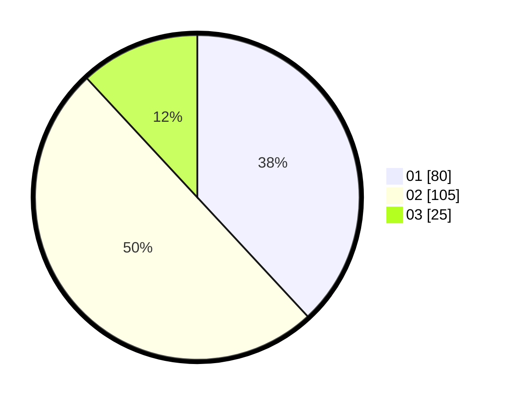

# Hasil

Hasil perolehan suara paslon dapat dilihat pada file paslon-01.txt, paslon-02.txt, dan paslon-03.txt.

Jika tidak ada, artinya data tersebut belum ada pada SIREKAP.

## Perolehan Suara

 * Paslon 01: **80**.
 * Paslon 02: **105**.
 * Paslon 03: **25**.

## Foto C Plano

https://sirekap-obj-formc.kpu.go.id/c788/pemilu/ppwp/31/73/06/10/05/3173061005054-20240215-002211--42de5019-beb9-4212-b11b-51d0896d69ca.jpg

https://sirekap-obj-formc.kpu.go.id/c788/pemilu/ppwp/31/73/06/10/05/3173061005054-20240215-002253--53a0287c-042e-4406-9a41-01258a4d2831.jpg

https://sirekap-obj-formc.kpu.go.id/c788/pemilu/ppwp/31/73/06/10/05/3173061005054-20240215-002318--692f7129-c914-460c-a78b-c44e0efabd43.jpg
