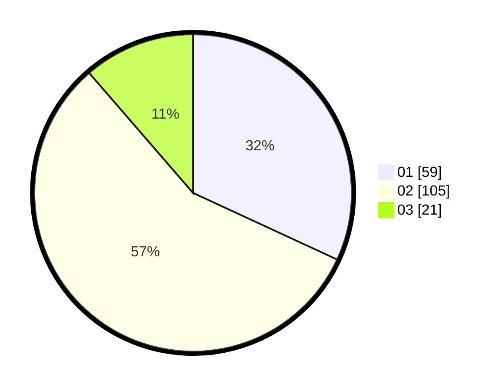

# Hasil

Hasil perolehan suara paslon dapat dilihat pada file paslon-01.txt, paslon-02.txt, dan paslon-03.txt.

Jika tidak ada, artinya data tersebut belum ada pada SIREKAP.

## Perolehan Suara

 * Paslon 01: **59**.
 * Paslon 02: **105**.
 * Paslon 03: **21**.

## Foto C Plano

https://sirekap-obj-formc.kpu.go.id/f45b/pemilu/ppwp/31/73/06/10/05/3173061005056-20240214-191849--b95e3dc9-c337-4d24-a5d4-b3ea58545f3c.jpg

https://sirekap-obj-formc.kpu.go.id/f45b/pemilu/ppwp/31/73/06/10/05/3173061005056-20240214-223813--2c4c201d-48f5-45f7-b373-264640feead9.jpg

https://sirekap-obj-formc.kpu.go.id/f45b/pemilu/ppwp/31/73/06/10/05/3173061005056-20240214-205619--823647fc-621f-4387-8074-94b5244c343b.jpg

## DATA PEMILIH TETAP

Jumlah pemilih dalam DPT: **264**.
 * L: **133**.
 * P: **131**.

## DATA PENGGUNA HAK PILIH

Jumlah pengguna hak pilih dalam DPT: **180**.
 * L: **86**.
 * P: **94**.

Jumlah pengguna hak pilih dalam DPTb: **0**.
 * L: **0**.
 * P: **0**.

Jumlah pengguna hak pilih dalam DPK: **5**.
 * L: **3**.
 * P: **2**.

Jumlah pengguna hak pilih: **185**.
 * L: **89**.
 * P: **96**.

## JUMLAH SUARA SAH DAN TIDAK SAH

JUMLAH SELURUH SUARA SAH: **185**.

JUMLAH SUARA TIDAK SAH: **2**.

JUMLAH SELURUH SUARA SAH DAN SUARA TIDAK SAH: **187**.
