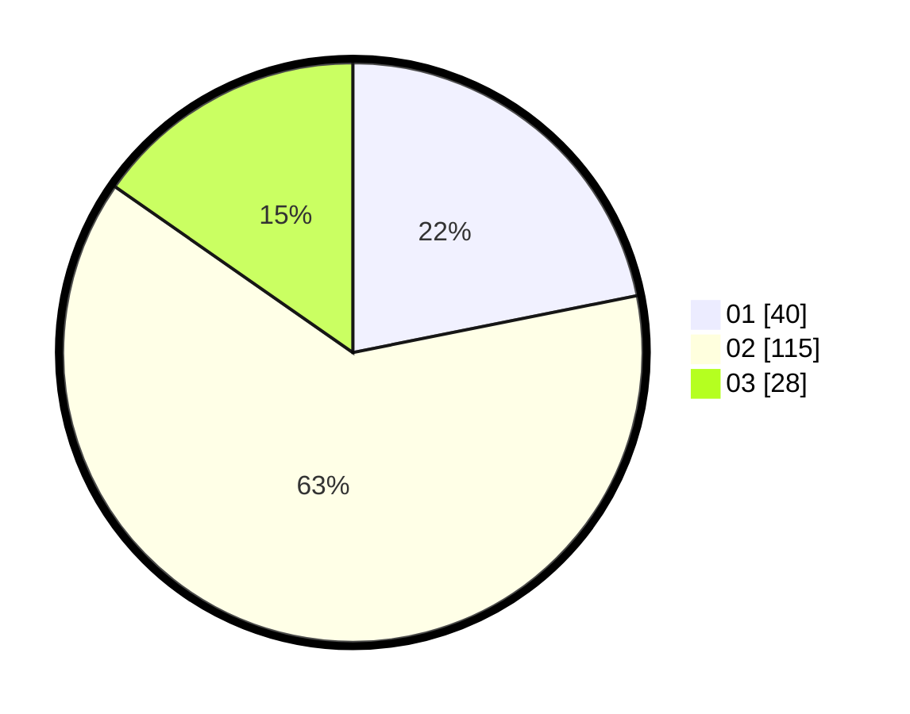

# Hasil

Hasil perolehan suara paslon dapat dilihat pada file paslon-01.txt, paslon-02.txt, dan paslon-03.txt.

Jika tidak ada, artinya data tersebut belum ada pada SIREKAP.

## Perolehan Suara

 * Paslon 01: **40**.
 * Paslon 02: **115**.
 * Paslon 03: **28**.

## Foto C Plano

https://sirekap-obj-formc.kpu.go.id/20c1/pemilu/ppwp/31/73/06/10/05/3173061005057-20240214-223931--8442b3b3-bca3-4a2d-8010-f584411a4a40.jpg

https://sirekap-obj-formc.kpu.go.id/20c1/pemilu/ppwp/31/73/06/10/05/3173061005057-20240217-233043--6e45b906-bb3d-49e8-ac64-618bb85f5cb2.jpg

https://sirekap-obj-formc.kpu.go.id/20c1/pemilu/ppwp/31/73/06/10/05/3173061005057-20240217-233313--af5764a8-5b50-4c76-9ba1-cc65afb44bb1.jpg
