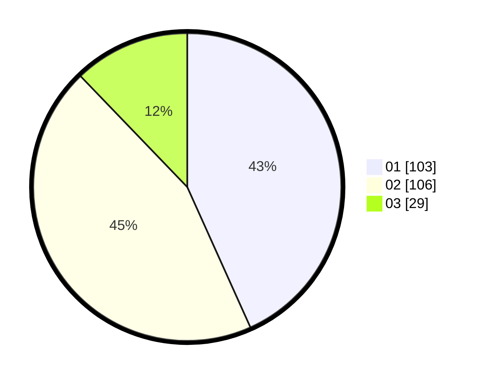

# Hasil

Hasil perolehan suara paslon dapat dilihat pada file paslon-01.txt, paslon-02.txt, dan paslon-03.txt.

Jika tidak ada, artinya data tersebut belum ada pada SIREKAP.

## Perolehan Suara

 * Paslon 01: **103**.
 * Paslon 02: **106**.
 * Paslon 03: **29**.

## Foto C Plano

https://sirekap-obj-formc.kpu.go.id/c056/pemilu/ppwp/31/73/06/10/05/3173061005059-20240214-234527--aa60752d-95a5-4fe6-be88-e91d11dac748.jpg

https://sirekap-obj-formc.kpu.go.id/c056/pemilu/ppwp/31/73/06/10/05/3173061005059-20240214-234630--d22b07ed-ac65-4349-9813-db8999203d88.jpg

https://sirekap-obj-formc.kpu.go.id/c056/pemilu/ppwp/31/73/06/10/05/3173061005059-20240214-234728--0573d966-07fe-4f19-9458-81f72a83cf87.jpg
