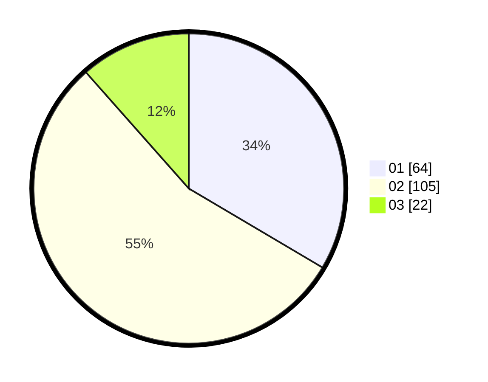

# Hasil

Hasil perolehan suara paslon dapat dilihat pada file paslon-01.txt, paslon-02.txt, dan paslon-03.txt.

Jika tidak ada, artinya data tersebut belum ada pada SIREKAP.

## Perolehan Suara

 * Paslon 01: **64**.
 * Paslon 02: **105**.
 * Paslon 03: **22**.

## Foto C Plano

https://sirekap-obj-formc.kpu.go.id/e5d0/pemilu/ppwp/31/73/06/10/05/3173061005060-20240215-010329--0b8a0022-2bd3-4d34-8474-4d5174a8c3d6.jpg

https://sirekap-obj-formc.kpu.go.id/e5d0/pemilu/ppwp/31/73/06/10/05/3173061005060-20240215-010449--756dfdd5-e9cf-4f85-9e97-47edc4bddf32.jpg

https://sirekap-obj-formc.kpu.go.id/e5d0/pemilu/ppwp/31/73/06/10/05/3173061005060-20240215-010600--a6527d44-5d60-4215-8c57-3cc3645dfaba.jpg
