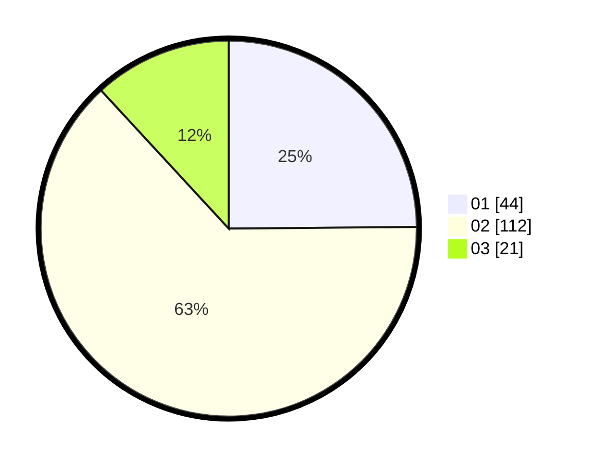

# Hasil

Hasil perolehan suara paslon dapat dilihat pada file paslon-01.txt, paslon-02.txt, dan paslon-03.txt.

Jika tidak ada, artinya data tersebut belum ada pada SIREKAP.

## Perolehan Suara

 * Paslon 01: **44**.
 * Paslon 02: **112**.
 * Paslon 03: **21**.

## Foto C Plano

https://sirekap-obj-formc.kpu.go.id/31b0/pemilu/ppwp/31/73/06/10/05/3173061005061-20240215-230848--7feb5eac-368f-4f95-b62a-08c9caa97065.jpg

https://sirekap-obj-formc.kpu.go.id/31b0/pemilu/ppwp/31/73/06/10/05/3173061005061-20240214-192451--b4430e34-1fd2-4237-b958-1376371d2408.jpg

https://sirekap-obj-formc.kpu.go.id/31b0/pemilu/ppwp/31/73/06/10/05/3173061005061-20240214-192505--e5a8be62-ec62-490c-a2a2-44166c5da843.jpg

## DATA PEMILIH TETAP

Jumlah pemilih dalam DPT: **174**.
 * L: **82**.
 * P: **92**.

## DATA PENGGUNA HAK PILIH

Jumlah pengguna hak pilih dalam DPT: **261**.
 * L: **121**.
 * P: **140**.

Jumlah pengguna hak pilih dalam DPTb: **5**.
 * L: **2**.
 * P: **3**.

Jumlah pengguna hak pilih dalam DPK: **1**.
 * L: **0**.
 * P: **1**.

Jumlah pengguna hak pilih: **267**.
 * L: **0**.
 * P: **0**.

## JUMLAH SUARA SAH DAN TIDAK SAH

JUMLAH SELURUH SUARA SAH: **177**.

JUMLAH SUARA TIDAK SAH: **6**.

JUMLAH SELURUH SUARA SAH DAN SUARA TIDAK SAH: **183**.
