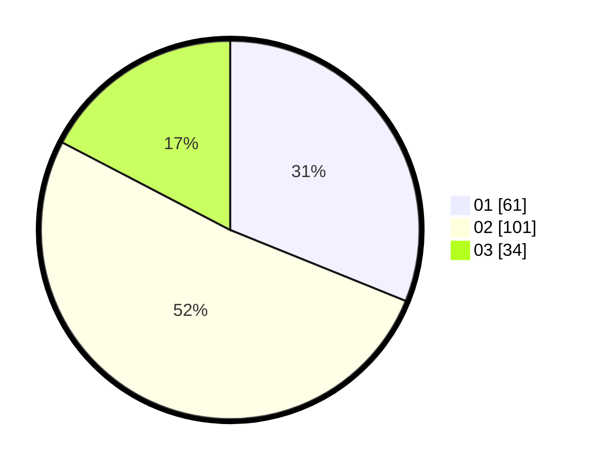

# Hasil

Hasil perolehan suara paslon dapat dilihat pada file paslon-01.txt, paslon-02.txt, dan paslon-03.txt.

Jika tidak ada, artinya data tersebut belum ada pada SIREKAP.

## Perolehan Suara

 * Paslon 01: **61**.
 * Paslon 02: **101**.
 * Paslon 03: **34**.

## Foto C Plano

https://sirekap-obj-formc.kpu.go.id/ee43/pemilu/ppwp/31/73/06/10/05/3173061005063-20240214-221806--f0e7c9d9-98f7-426d-9c55-ee4c442dd579.jpg

https://sirekap-obj-formc.kpu.go.id/ee43/pemilu/ppwp/31/73/06/10/05/3173061005063-20240214-221713--70536c4a-b8d6-4182-b42d-7077adab256a.jpg

https://sirekap-obj-formc.kpu.go.id/ee43/pemilu/ppwp/31/73/06/10/05/3173061005063-20240214-221853--21876fb3-64ec-4335-981e-a512f596ba00.jpg
