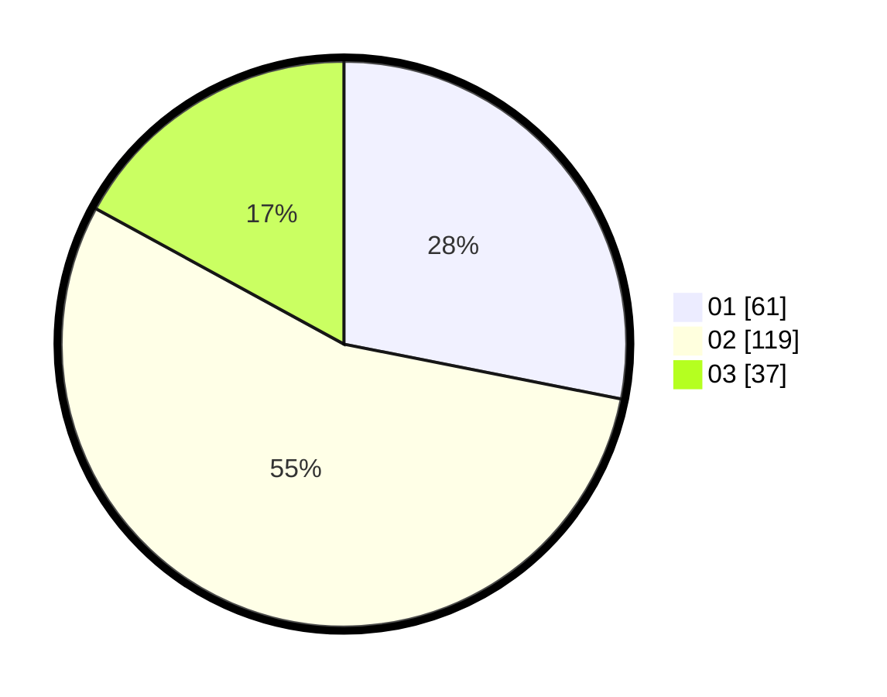

# Hasil

Hasil perolehan suara paslon dapat dilihat pada file paslon-01.txt, paslon-02.txt, dan paslon-03.txt.

Jika tidak ada, artinya data tersebut belum ada pada SIREKAP.

## Perolehan Suara

 * Paslon 01: **61**.
 * Paslon 02: **119**.
 * Paslon 03: **37**.

## Foto C Plano

https://sirekap-obj-formc.kpu.go.id/b03e/pemilu/ppwp/31/73/06/10/05/3173061005065-20240214-210044--0b9ae5c3-985c-4bb3-aa67-c21682dec4ab.jpg

https://sirekap-obj-formc.kpu.go.id/b03e/pemilu/ppwp/31/73/06/10/05/3173061005065-20240214-210047--b44aac20-d075-4168-b06c-d09da8c18306.jpg

https://sirekap-obj-formc.kpu.go.id/b03e/pemilu/ppwp/31/73/06/10/05/3173061005065-20240214-210050--49645565-b674-4876-ad4f-8948b38ff168.jpg
