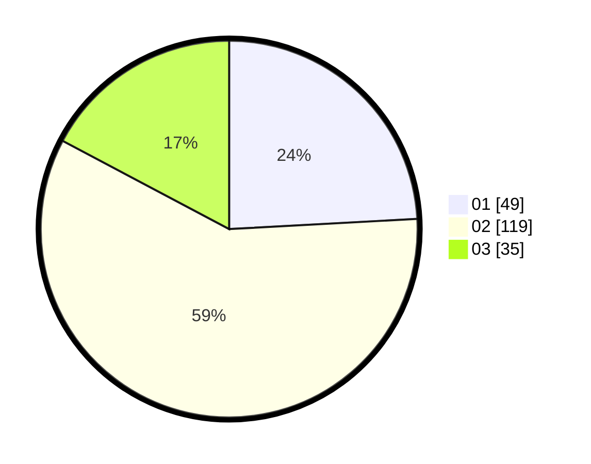

# Hasil

Hasil perolehan suara paslon dapat dilihat pada file paslon-01.txt, paslon-02.txt, dan paslon-03.txt.

Jika tidak ada, artinya data tersebut belum ada pada SIREKAP.

## Perolehan Suara

 * Paslon 01: **49**.
 * Paslon 02: **119**.
 * Paslon 03: **35**.

## Foto C Plano

https://sirekap-obj-formc.kpu.go.id/4dea/pemilu/ppwp/31/73/06/10/05/3173061005066-20240214-215903--45daa483-dd68-4241-881e-576885115275.jpg

https://sirekap-obj-formc.kpu.go.id/4dea/pemilu/ppwp/31/73/06/10/05/3173061005066-20240214-221615--cb876932-9411-437b-92f2-2a31a06c2ebd.jpg

https://sirekap-obj-formc.kpu.go.id/4dea/pemilu/ppwp/31/73/06/10/05/3173061005066-20240214-221928--2ede60cf-0a96-49cd-af96-a86e46ca3c2e.jpg

## DATA PEMILIH TETAP

Jumlah pemilih dalam DPT: **279**.
 * L: **130**.
 * P: **149**.

## DATA PENGGUNA HAK PILIH

Jumlah pengguna hak pilih dalam DPT: **197**.
 * L: **93**.
 * P: **114**.

Jumlah pengguna hak pilih dalam DPTb: **2**.
 * L: **0**.
 * P: **2**.

Jumlah pengguna hak pilih dalam DPK: **6**.
 * L: **3**.
 * P: **3**.

Jumlah pengguna hak pilih: **205**.
 * L: **96**.
 * P: **109**.

## JUMLAH SUARA SAH DAN TIDAK SAH

JUMLAH SELURUH SUARA SAH: **203**.

JUMLAH SUARA TIDAK SAH: **5**.

JUMLAH SELURUH SUARA SAH DAN SUARA TIDAK SAH: **208**.
