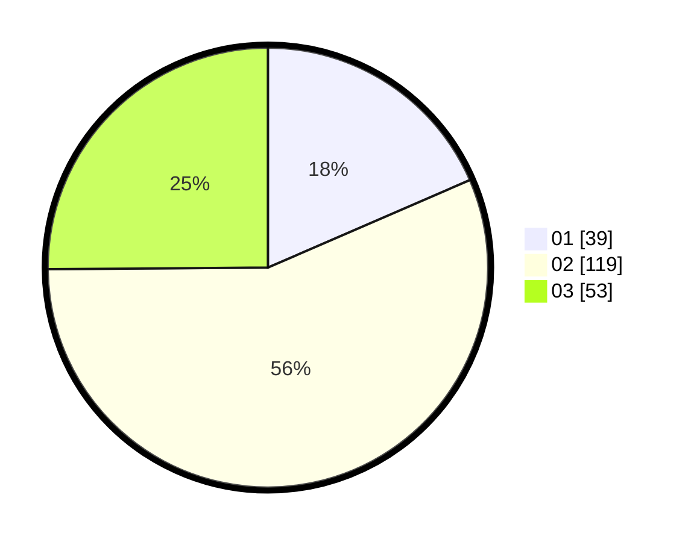

# Hasil

Hasil perolehan suara paslon dapat dilihat pada file paslon-01.txt, paslon-02.txt, dan paslon-03.txt.

Jika tidak ada, artinya data tersebut belum ada pada SIREKAP.

## Perolehan Suara

 * Paslon 01: **39**.
 * Paslon 02: **119**.
 * Paslon 03: **53**.

## Foto C Plano

https://sirekap-obj-formc.kpu.go.id/a2ad/pemilu/ppwp/31/73/06/10/05/3173061005068-20240214-193532--2654c3c8-6bea-4f0c-b4d8-37527e541a86.jpg

https://sirekap-obj-formc.kpu.go.id/a2ad/pemilu/ppwp/31/73/06/10/05/3173061005068-20240214-194727--172c288e-3b24-49a5-ae0f-6721a6ad611e.jpg
