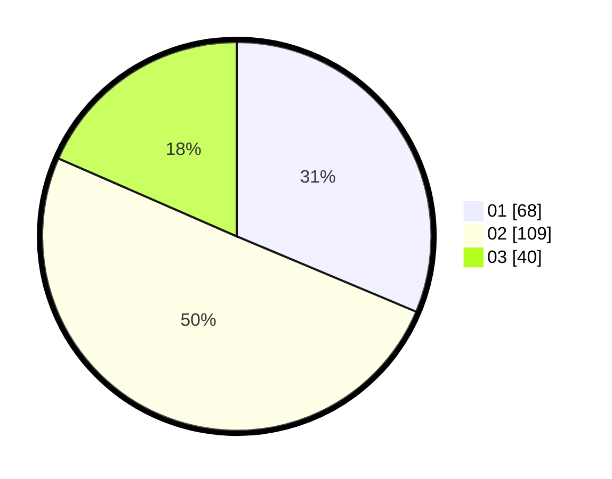

# Hasil

Hasil perolehan suara paslon dapat dilihat pada file paslon-01.txt, paslon-02.txt, dan paslon-03.txt.

Jika tidak ada, artinya data tersebut belum ada pada SIREKAP.

## Perolehan Suara

 * Paslon 01: **68**.
 * Paslon 02: **109**.
 * Paslon 03: **40**.

## Foto C Plano

https://sirekap-obj-formc.kpu.go.id/f8ed/pemilu/ppwp/31/73/06/10/05/3173061005070-20240214-205628--1777dbe4-e7fe-4148-9f2d-8e490c02d23b.jpg

https://sirekap-obj-formc.kpu.go.id/f8ed/pemilu/ppwp/31/73/06/10/05/3173061005070-20240214-205743--cd85348a-419d-4912-9e6a-b3b0379a9cbc.jpg

https://sirekap-obj-formc.kpu.go.id/f8ed/pemilu/ppwp/31/73/06/10/05/3173061005070-20240214-205851--5d552909-f8d1-495c-a8bf-a9e3976802e1.jpg
