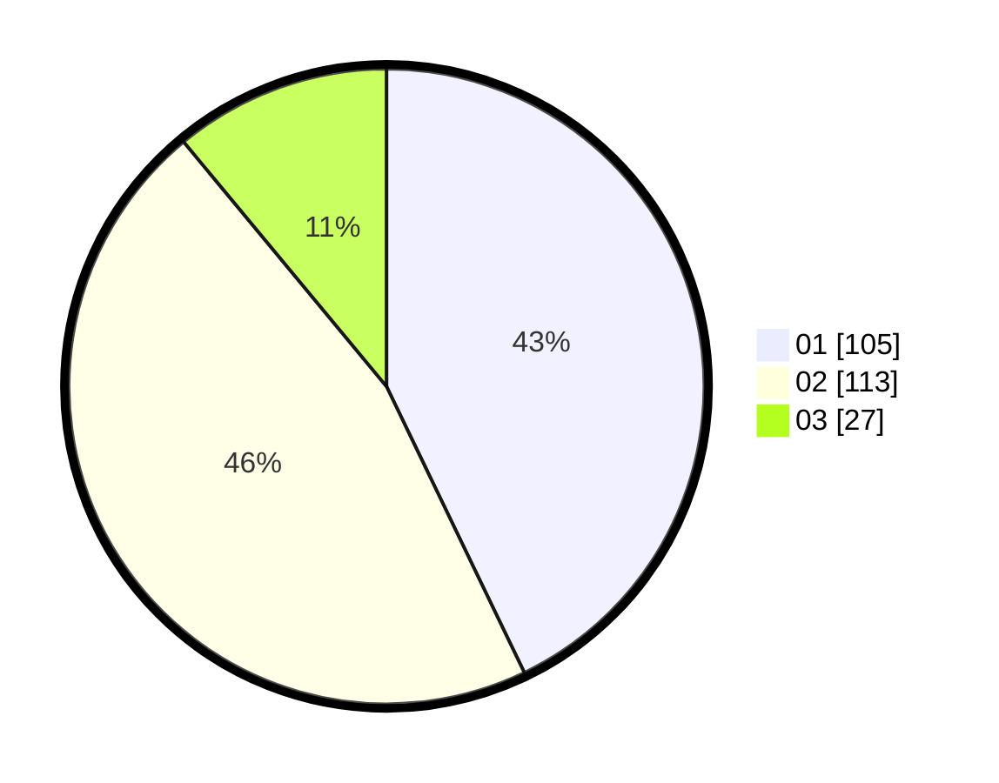

# Hasil

Hasil perolehan suara paslon dapat dilihat pada file paslon-01.txt, paslon-02.txt, dan paslon-03.txt.

Jika tidak ada, artinya data tersebut belum ada pada SIREKAP.

## Perolehan Suara

 * Paslon 01: **105**.
 * Paslon 02: **113**.
 * Paslon 03: **27**.

## Foto C Plano

https://sirekap-obj-formc.kpu.go.id/9752/pemilu/ppwp/31/73/06/10/05/3173061005081-20240214-204557--97136efa-1b13-4a67-b99b-bce3b485bd38.jpg

https://sirekap-obj-formc.kpu.go.id/9752/pemilu/ppwp/31/73/06/10/05/3173061005081-20240214-204604--88194872-ae50-48ba-928f-c981c9a5df03.jpg

https://sirekap-obj-formc.kpu.go.id/9752/pemilu/ppwp/31/73/06/10/05/3173061005081-20240214-204609--c0188056-5921-49b7-bdd7-3fd2d6829857.jpg

## DATA PEMILIH TETAP

Jumlah pemilih dalam DPT: **267**.
 * L: **131**.
 * P: **136**.

## DATA PENGGUNA HAK PILIH

Jumlah pengguna hak pilih dalam DPT: **250**.
 * L: **122**.
 * P: **128**.

Jumlah pengguna hak pilih dalam DPTb: **0**.
 * L: **0**.
 * P: **0**.

Jumlah pengguna hak pilih dalam DPK: **0**.
 * L: **0**.
 * P: **0**.

Jumlah pengguna hak pilih: **250**.
 * L: **122**.
 * P: **128**.

## JUMLAH SUARA SAH DAN TIDAK SAH

JUMLAH SELURUH SUARA SAH: **245**.

JUMLAH SUARA TIDAK SAH: **5**.

JUMLAH SELURUH SUARA SAH DAN SUARA TIDAK SAH: **250**.
