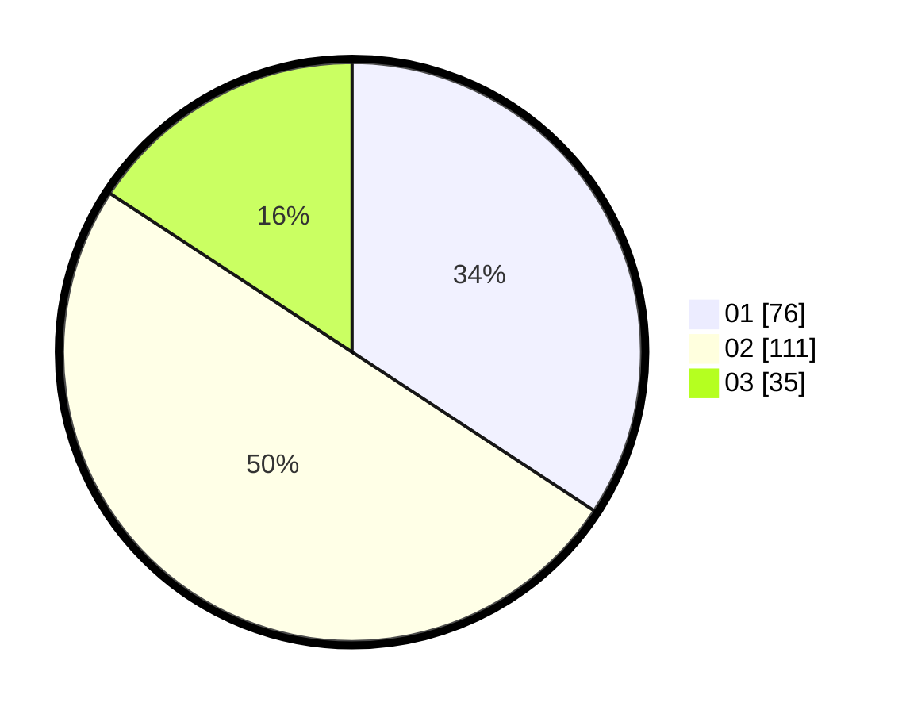

# Hasil

Hasil perolehan suara paslon dapat dilihat pada file paslon-01.txt, paslon-02.txt, dan paslon-03.txt.

Jika tidak ada, artinya data tersebut belum ada pada SIREKAP.

## Perolehan Suara

 * Paslon 01: **76**.
 * Paslon 02: **111**.
 * Paslon 03: **35**.

## Foto C Plano

https://sirekap-obj-formc.kpu.go.id/e8c7/pemilu/ppwp/31/73/06/10/05/3173061005082-20240216-030914--702ead20-fec7-45af-8d04-2ae48f86d116.jpg

https://sirekap-obj-formc.kpu.go.id/e8c7/pemilu/ppwp/31/73/06/10/05/3173061005082-20240216-030915--20458e9a-00c2-425b-bd6a-fd96ba8394c8.jpg

https://sirekap-obj-formc.kpu.go.id/e8c7/pemilu/ppwp/31/73/06/10/05/3173061005082-20240216-030915--2deedcda-14f5-48c1-8e85-c46312aaf593.jpg

## DATA PEMILIH TETAP

Jumlah pemilih dalam DPT: **271**.
 * L: **143**.
 * P: **128**.

## DATA PENGGUNA HAK PILIH

Jumlah pengguna hak pilih dalam DPT: **227**.
 * L: **121**.
 * P: **106**.

Jumlah pengguna hak pilih dalam DPTb: **0**.
 * L: **0**.
 * P: **0**.

Jumlah pengguna hak pilih dalam DPK: **0**.
 * L: **0**.
 * P: **0**.

Jumlah pengguna hak pilih: **227**.
 * L: **121**.
 * P: **106**.

## JUMLAH SUARA SAH DAN TIDAK SAH

JUMLAH SELURUH SUARA SAH: **222**.

JUMLAH SUARA TIDAK SAH: **5**.

JUMLAH SELURUH SUARA SAH DAN SUARA TIDAK SAH: **227**.
