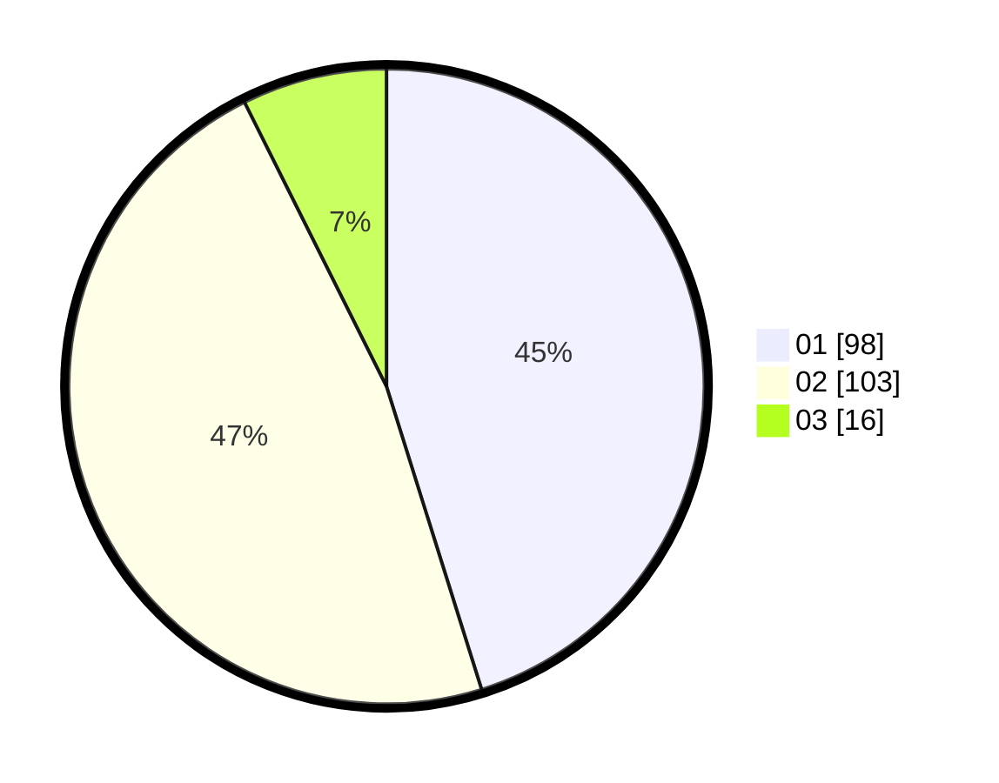

# Hasil

Hasil perolehan suara paslon dapat dilihat pada file paslon-01.txt, paslon-02.txt, dan paslon-03.txt.

Jika tidak ada, artinya data tersebut belum ada pada SIREKAP.

## Perolehan Suara

 * Paslon 01: **98**.
 * Paslon 02: **103**.
 * Paslon 03: **16**.

## Foto C Plano

https://sirekap-obj-formc.kpu.go.id/6167/pemilu/ppwp/31/73/06/10/05/3173061005086-20240214-223444--9175de27-27bd-4944-b97c-117fdde16b36.jpg

https://sirekap-obj-formc.kpu.go.id/6167/pemilu/ppwp/31/73/06/10/05/3173061005086-20240214-223352--1927226b-a33f-439a-b8df-bfa734f3b805.jpg

https://sirekap-obj-formc.kpu.go.id/6167/pemilu/ppwp/31/73/06/10/05/3173061005086-20240214-223710--d648fcce-e885-449e-ae68-78ed3497bd3d.jpg
