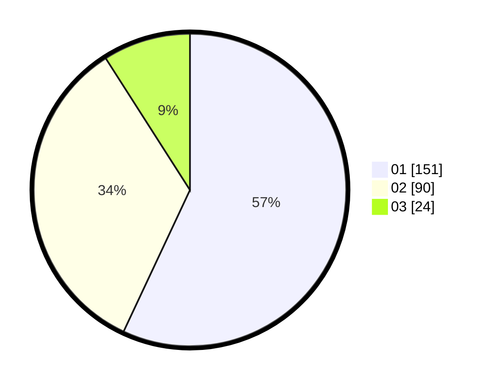

# Hasil

Hasil perolehan suara paslon dapat dilihat pada file paslon-01.txt, paslon-02.txt, dan paslon-03.txt.

Jika tidak ada, artinya data tersebut belum ada pada SIREKAP.

## Perolehan Suara

 * Paslon 01: **151**.
 * Paslon 02: **90**.
 * Paslon 03: **24**.

## Foto C Plano

https://sirekap-obj-formc.kpu.go.id/b62f/pemilu/ppwp/31/73/06/10/05/3173061005089-20240214-201145--369481af-b4fe-413d-aff3-8d734259936c.jpg

https://sirekap-obj-formc.kpu.go.id/b62f/pemilu/ppwp/31/73/06/10/05/3173061005089-20240214-201216--df567531-a204-4b9b-b317-9bd0b35d3ba5.jpg

https://sirekap-obj-formc.kpu.go.id/b62f/pemilu/ppwp/31/73/06/10/05/3173061005089-20240214-201102--8d216e73-b676-49b9-8b65-1da81606ebff.jpg

## DATA PEMILIH TETAP

Jumlah pemilih dalam DPT: **293**.
 * L: **142**.
 * P: **151**.

## DATA PENGGUNA HAK PILIH

Jumlah pengguna hak pilih dalam DPT: **258**.
 * L: **123**.
 * P: **135**.

Jumlah pengguna hak pilih dalam DPTb: **7**.
 * L: **4**.
 * P: **3**.

Jumlah pengguna hak pilih dalam DPK: **3**.
 * L: **1**.
 * P: **2**.

Jumlah pengguna hak pilih: **268**.
 * L: **128**.
 * P: **140**.

## JUMLAH SUARA SAH DAN TIDAK SAH

JUMLAH SELURUH SUARA SAH: **265**.

JUMLAH SUARA TIDAK SAH: **3**.

JUMLAH SELURUH SUARA SAH DAN SUARA TIDAK SAH: **268**.
