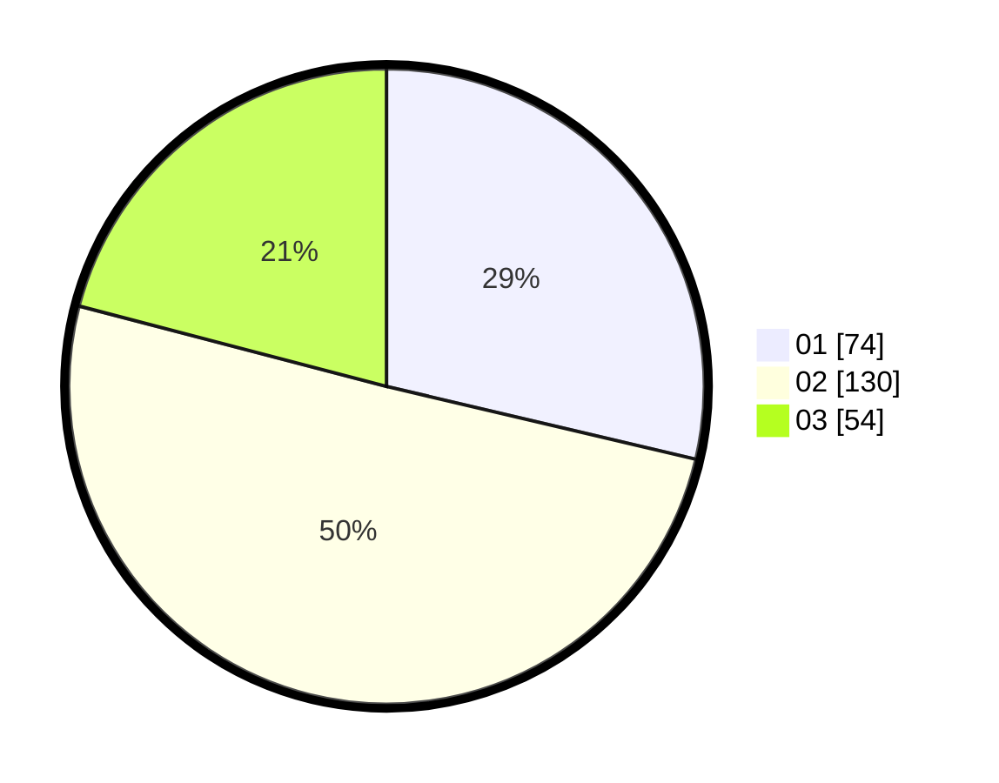

# Hasil

Hasil perolehan suara paslon dapat dilihat pada file paslon-01.txt, paslon-02.txt, dan paslon-03.txt.

Jika tidak ada, artinya data tersebut belum ada pada SIREKAP.

## Perolehan Suara

 * Paslon 01: **74**.
 * Paslon 02: **130**.
 * Paslon 03: **54**.

## Foto C Plano

https://sirekap-obj-formc.kpu.go.id/fb3f/pemilu/ppwp/31/73/06/10/05/3173061005091-20240214-215510--9060223c-5b90-470c-be47-9f1e6d7fcbe5.jpg

https://sirekap-obj-formc.kpu.go.id/fb3f/pemilu/ppwp/31/73/06/10/05/3173061005091-20240214-215544--aa9ac10b-878a-4284-9cd8-eb259e04c46a.jpg

https://sirekap-obj-formc.kpu.go.id/fb3f/pemilu/ppwp/31/73/06/10/05/3173061005091-20240214-215638--0fbed9e8-4201-4df5-ad40-7185d14b8c57.jpg
