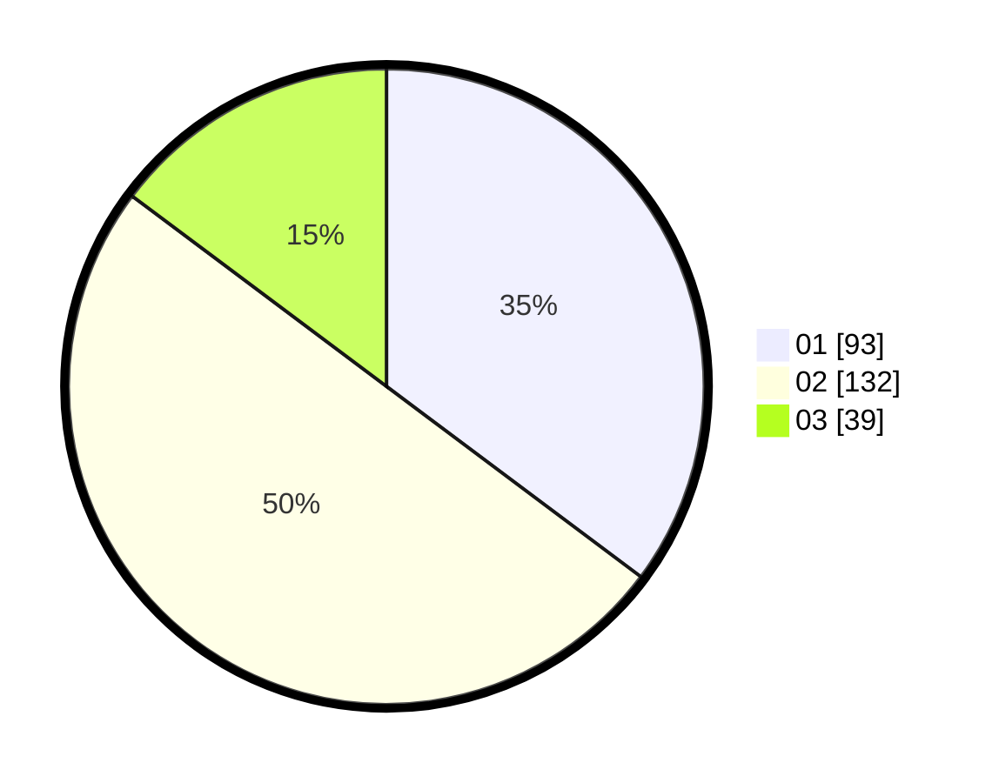

# Hasil

Hasil perolehan suara paslon dapat dilihat pada file paslon-01.txt, paslon-02.txt, dan paslon-03.txt.

Jika tidak ada, artinya data tersebut belum ada pada SIREKAP.

## Perolehan Suara

 * Paslon 01: **93**.
 * Paslon 02: **132**.
 * Paslon 03: **39**.

## Foto C Plano

https://sirekap-obj-formc.kpu.go.id/fdcc/pemilu/ppwp/31/73/06/10/05/3173061005093-20240214-184527--1b2a11e0-6274-4dcb-b32b-cc688a6b7d4a.jpg

https://sirekap-obj-formc.kpu.go.id/fdcc/pemilu/ppwp/31/73/06/10/05/3173061005093-20240214-184543--0479bcc4-6928-4bfc-b532-b7346a7beb9c.jpg

https://sirekap-obj-formc.kpu.go.id/fdcc/pemilu/ppwp/31/73/06/10/05/3173061005093-20240214-184453--2380dee4-12a8-43ca-a35a-bef4f53e6a63.jpg
