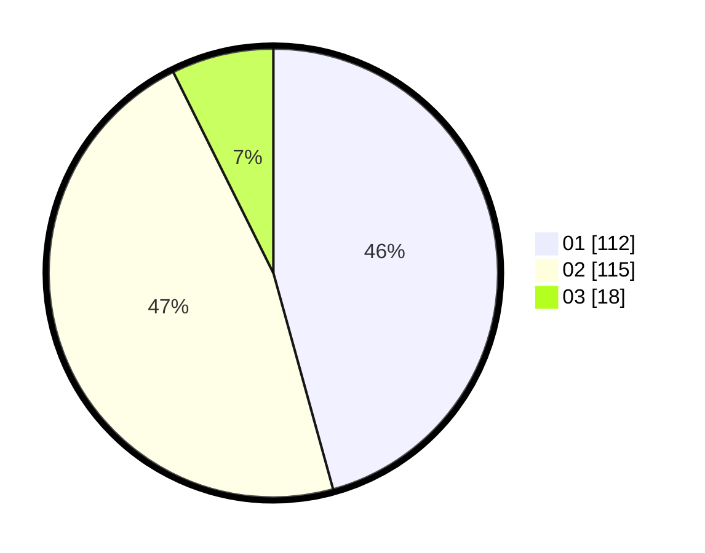

# Hasil

Hasil perolehan suara paslon dapat dilihat pada file paslon-01.txt, paslon-02.txt, dan paslon-03.txt.

Jika tidak ada, artinya data tersebut belum ada pada SIREKAP.

## Perolehan Suara

 * Paslon 01: **112**.
 * Paslon 02: **115**.
 * Paslon 03: **18**.

## Foto C Plano

https://sirekap-obj-formc.kpu.go.id/777e/pemilu/ppwp/31/73/06/10/05/3173061005100-20240214-230611--50f61cdd-e7b3-48ff-97cd-65693e1c78ac.jpg

https://sirekap-obj-formc.kpu.go.id/777e/pemilu/ppwp/31/73/06/10/05/3173061005100-20240214-230809--541feb45-b933-4af5-94dc-ae225e3a3ba7.jpg

https://sirekap-obj-formc.kpu.go.id/777e/pemilu/ppwp/31/73/06/10/05/3173061005100-20240214-230931--6ca97256-fb54-4c77-be2b-564dcea9c370.jpg
