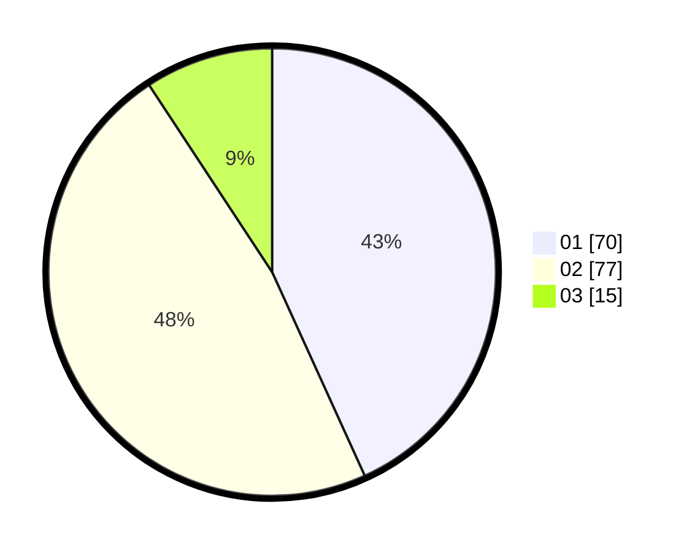

# Hasil

Hasil perolehan suara paslon dapat dilihat pada file paslon-01.txt, paslon-02.txt, dan paslon-03.txt.

Jika tidak ada, artinya data tersebut belum ada pada SIREKAP.

## Perolehan Suara

 * Paslon 01: **70**.
 * Paslon 02: **77**.
 * Paslon 03: **15**.

## Foto C Plano

https://sirekap-obj-formc.kpu.go.id/3149/pemilu/ppwp/31/73/06/10/05/3173061005101-20240214-231722--1cfaf265-95a1-496b-a70e-4c1069276d83.jpg

https://sirekap-obj-formc.kpu.go.id/3149/pemilu/ppwp/31/73/06/10/05/3173061005101-20240214-231818--6d425b69-b1b9-4444-b0a1-0361f85008f6.jpg

https://sirekap-obj-formc.kpu.go.id/3149/pemilu/ppwp/31/73/06/10/05/3173061005101-20240214-231923--fa4db586-1875-4782-8a50-e37edc8aad98.jpg
