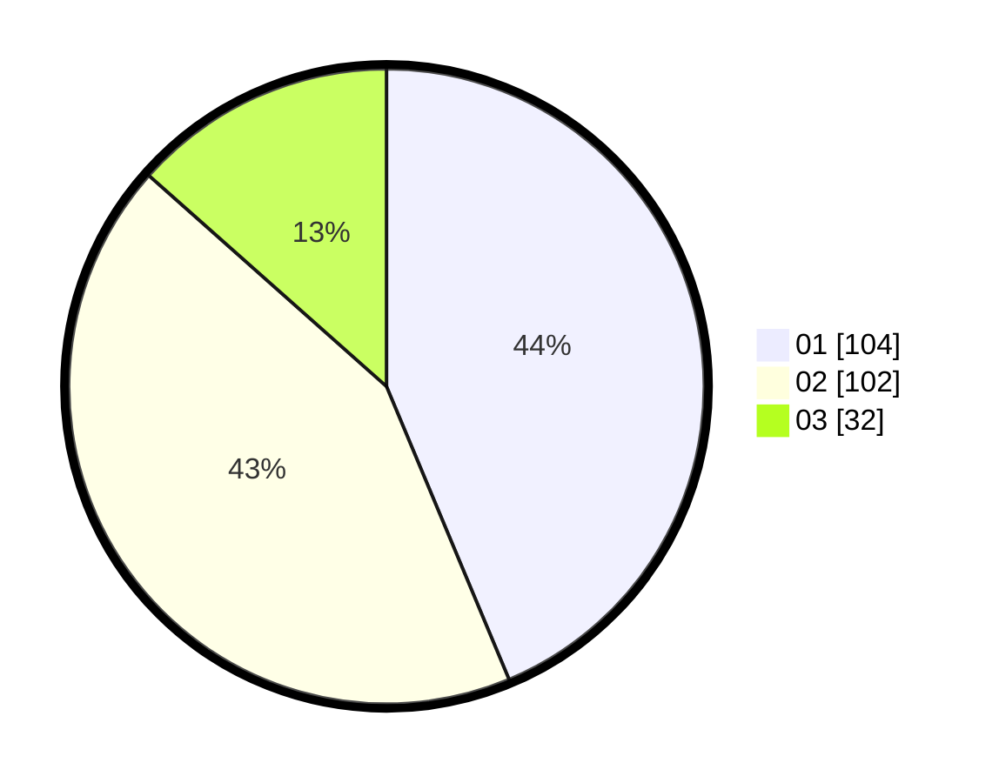

# Hasil

Hasil perolehan suara paslon dapat dilihat pada file paslon-01.txt, paslon-02.txt, dan paslon-03.txt.

Jika tidak ada, artinya data tersebut belum ada pada SIREKAP.

## Perolehan Suara

 * Paslon 01: **104**.
 * Paslon 02: **102**.
 * Paslon 03: **32**.

## Foto C Plano

https://sirekap-obj-formc.kpu.go.id/3949/pemilu/ppwp/31/73/06/10/05/3173061005106-20240214-203351--7e12c799-d0e4-40d4-bdbb-8190fedc5611.jpg

https://sirekap-obj-formc.kpu.go.id/3949/pemilu/ppwp/31/73/06/10/05/3173061005106-20240214-203354--896f4178-4229-4261-a931-214480c6b640.jpg

https://sirekap-obj-formc.kpu.go.id/3949/pemilu/ppwp/31/73/06/10/05/3173061005106-20240214-203357--0b86f9b7-2eb3-4b19-80fa-59e91781c2bd.jpg
