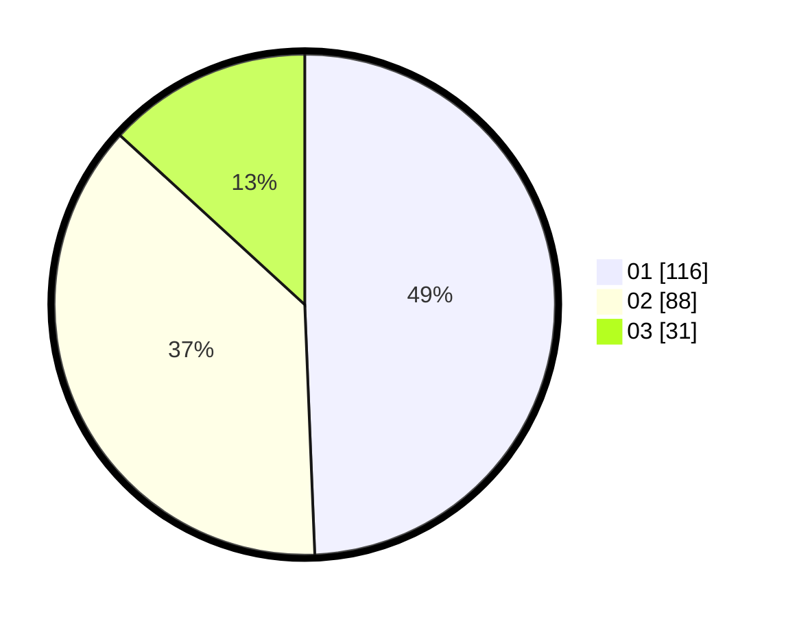

# Hasil

Hasil perolehan suara paslon dapat dilihat pada file paslon-01.txt, paslon-02.txt, dan paslon-03.txt.

Jika tidak ada, artinya data tersebut belum ada pada SIREKAP.

## Perolehan Suara

 * Paslon 01: **116**.
 * Paslon 02: **88**.
 * Paslon 03: **31**.

## Foto C Plano

https://sirekap-obj-formc.kpu.go.id/37f3/pemilu/ppwp/31/73/06/10/05/3173061005110-20240215-042102--54f9d881-6787-4558-b210-9768cccd64c6.jpg

https://sirekap-obj-formc.kpu.go.id/37f3/pemilu/ppwp/31/73/06/10/05/3173061005110-20240215-042430--70590920-64ed-48ca-b8a8-93ba846aba81.jpg

https://sirekap-obj-formc.kpu.go.id/37f3/pemilu/ppwp/31/73/06/10/05/3173061005110-20240215-042613--e2c754b5-bbfd-432c-bf13-1bc8e74eb8ff.jpg
