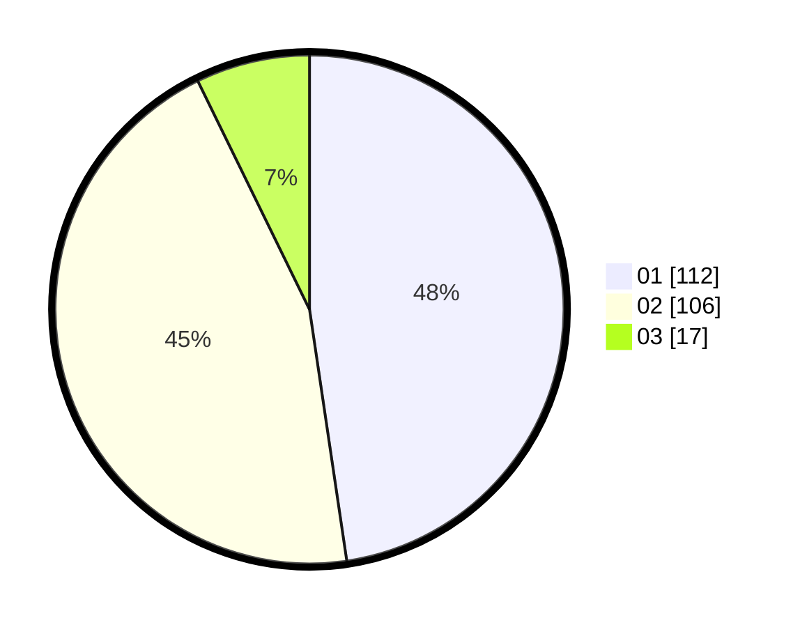

# Hasil

Hasil perolehan suara paslon dapat dilihat pada file paslon-01.txt, paslon-02.txt, dan paslon-03.txt.

Jika tidak ada, artinya data tersebut belum ada pada SIREKAP.

## Perolehan Suara

 * Paslon 01: **112**.
 * Paslon 02: **106**.
 * Paslon 03: **17**.

## Foto C Plano

https://sirekap-obj-formc.kpu.go.id/e2b0/pemilu/ppwp/31/73/06/10/05/3173061005111-20240214-213913--07f38b48-ed4d-40af-8bf8-1557a50b8737.jpg

https://sirekap-obj-formc.kpu.go.id/e2b0/pemilu/ppwp/31/73/06/10/05/3173061005111-20240214-214019--56b85bf5-dbee-4475-bb26-f62337bc4c38.jpg

https://sirekap-obj-formc.kpu.go.id/e2b0/pemilu/ppwp/31/73/06/10/05/3173061005111-20240214-214105--3afcf953-cdaf-4a1e-ad05-b94df4534057.jpg
