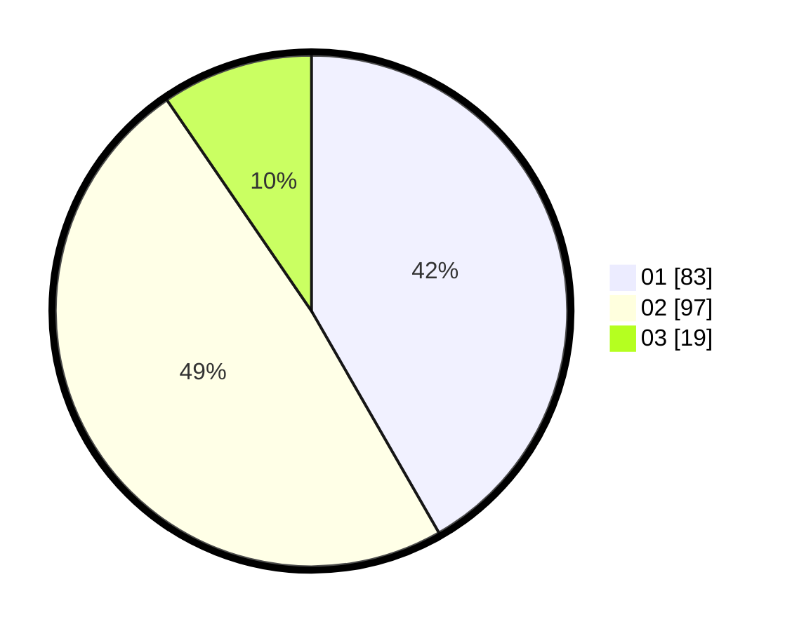

# Hasil

Hasil perolehan suara paslon dapat dilihat pada file paslon-01.txt, paslon-02.txt, dan paslon-03.txt.

Jika tidak ada, artinya data tersebut belum ada pada SIREKAP.

## Perolehan Suara

 * Paslon 01: **83**.
 * Paslon 02: **97**.
 * Paslon 03: **19**.

## Foto C Plano

https://sirekap-obj-formc.kpu.go.id/802a/pemilu/ppwp/31/73/06/10/05/3173061005113-20240216-094243--07b5d19e-1b68-49cb-813d-8389947de5c8.jpg

https://sirekap-obj-formc.kpu.go.id/802a/pemilu/ppwp/31/73/06/10/05/3173061005113-20240214-215607--27464e20-501c-4171-92eb-75734c271d2e.jpg

https://sirekap-obj-formc.kpu.go.id/802a/pemilu/ppwp/31/73/06/10/05/3173061005113-20240214-215915--bbeac9b2-a63f-4aa4-98d6-9cf16b02332e.jpg

## DATA PEMILIH TETAP

Jumlah pemilih dalam DPT: **246**.
 * L: **126**.
 * P: **120**.

## DATA PENGGUNA HAK PILIH

Jumlah pengguna hak pilih dalam DPT: **206**.
 * L: **105**.
 * P: **101**.

Jumlah pengguna hak pilih dalam DPTb: **0**.
 * L: **0**.
 * P: **0**.

Jumlah pengguna hak pilih dalam DPK: **0**.
 * L: **0**.
 * P: **0**.

Jumlah pengguna hak pilih: **206**.
 * L: **105**.
 * P: **101**.

## JUMLAH SUARA SAH DAN TIDAK SAH

JUMLAH SELURUH SUARA SAH: **199**.

JUMLAH SUARA TIDAK SAH: **7**.

JUMLAH SELURUH SUARA SAH DAN SUARA TIDAK SAH: **206**.
