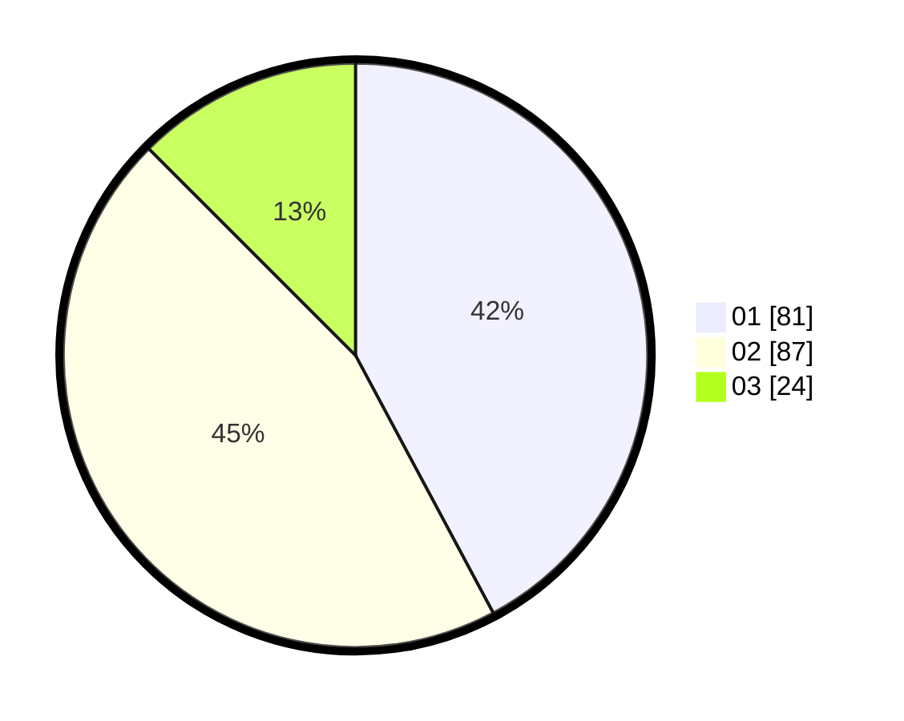

# Hasil

Hasil perolehan suara paslon dapat dilihat pada file paslon-01.txt, paslon-02.txt, dan paslon-03.txt.

Jika tidak ada, artinya data tersebut belum ada pada SIREKAP.

## Perolehan Suara

 * Paslon 01: **81**.
 * Paslon 02: **87**.
 * Paslon 03: **24**.

## Foto C Plano

https://sirekap-obj-formc.kpu.go.id/6a1c/pemilu/ppwp/31/73/06/10/05/3173061005118-20240214-233325--c90eae2f-0a8a-4ce7-92b5-14324f4d040a.jpg

https://sirekap-obj-formc.kpu.go.id/6a1c/pemilu/ppwp/31/73/06/10/05/3173061005118-20240214-200732--50bd6dcd-0965-48b4-af8f-1ede8932ac20.jpg

https://sirekap-obj-formc.kpu.go.id/6a1c/pemilu/ppwp/31/73/06/10/05/3173061005118-20240214-235138--672cac40-90c8-460b-b271-3288869408e6.jpg
