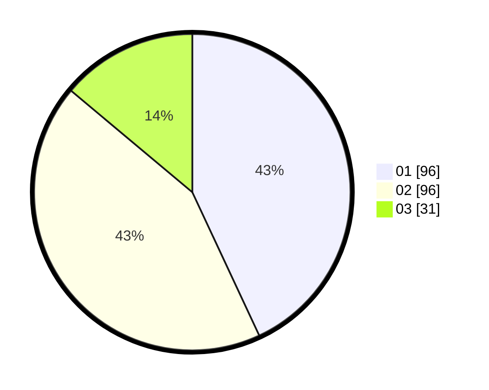

# Hasil

Hasil perolehan suara paslon dapat dilihat pada file paslon-01.txt, paslon-02.txt, dan paslon-03.txt.

Jika tidak ada, artinya data tersebut belum ada pada SIREKAP.

## Perolehan Suara

 * Paslon 01: **96**.
 * Paslon 02: **96**.
 * Paslon 03: **31**.

## Foto C Plano

https://sirekap-obj-formc.kpu.go.id/2f26/pemilu/ppwp/31/73/06/10/05/3173061005119-20240214-221850--26320723-b961-4382-aae2-5f4a7375039f.jpg

https://sirekap-obj-formc.kpu.go.id/2f26/pemilu/ppwp/31/73/06/10/05/3173061005119-20240214-221955--74ca57fc-be2b-4007-a12e-7f4661424ff0.jpg

https://sirekap-obj-formc.kpu.go.id/2f26/pemilu/ppwp/31/73/06/10/05/3173061005119-20240214-222021--e90458eb-1ee1-4f40-b4fb-52b23943393d.jpg
