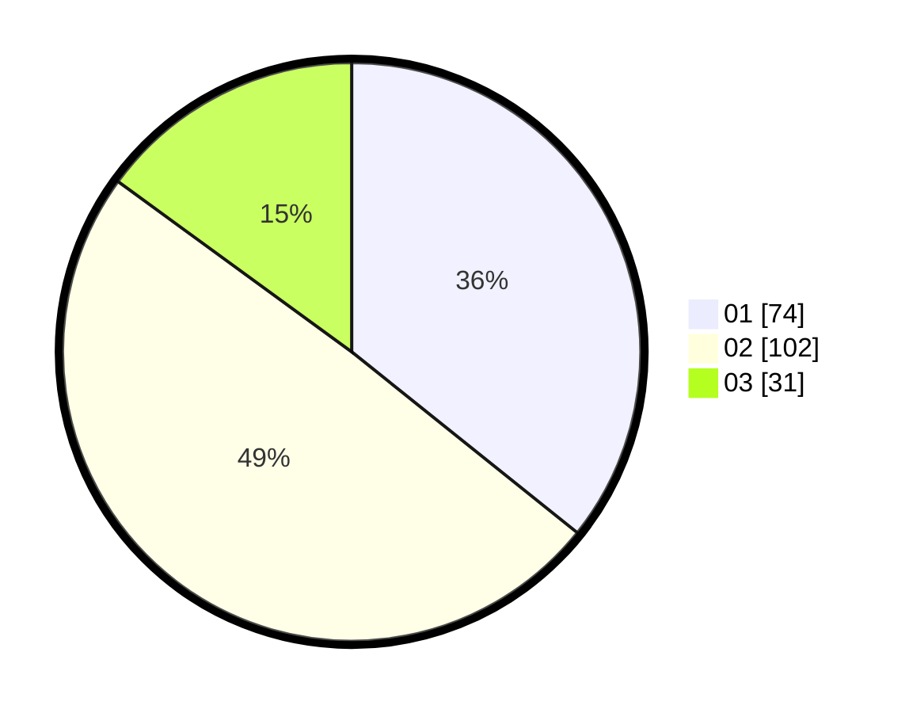

# Hasil

Hasil perolehan suara paslon dapat dilihat pada file paslon-01.txt, paslon-02.txt, dan paslon-03.txt.

Jika tidak ada, artinya data tersebut belum ada pada SIREKAP.

## Perolehan Suara

 * Paslon 01: **74**.
 * Paslon 02: **102**.
 * Paslon 03: **31**.

## Foto C Plano

https://sirekap-obj-formc.kpu.go.id/7f2e/pemilu/ppwp/31/73/06/10/05/3173061005121-20240215-000109--e24ea954-937e-487e-a6d9-8d42a4a228f1.jpg

https://sirekap-obj-formc.kpu.go.id/7f2e/pemilu/ppwp/31/73/06/10/05/3173061005121-20240215-000227--d0249429-bea4-4085-b49a-b44559233054.jpg

https://sirekap-obj-formc.kpu.go.id/7f2e/pemilu/ppwp/31/73/06/10/05/3173061005121-20240215-000316--2b19c4e5-fb4c-4f1b-8ee4-a82458e9fa55.jpg
