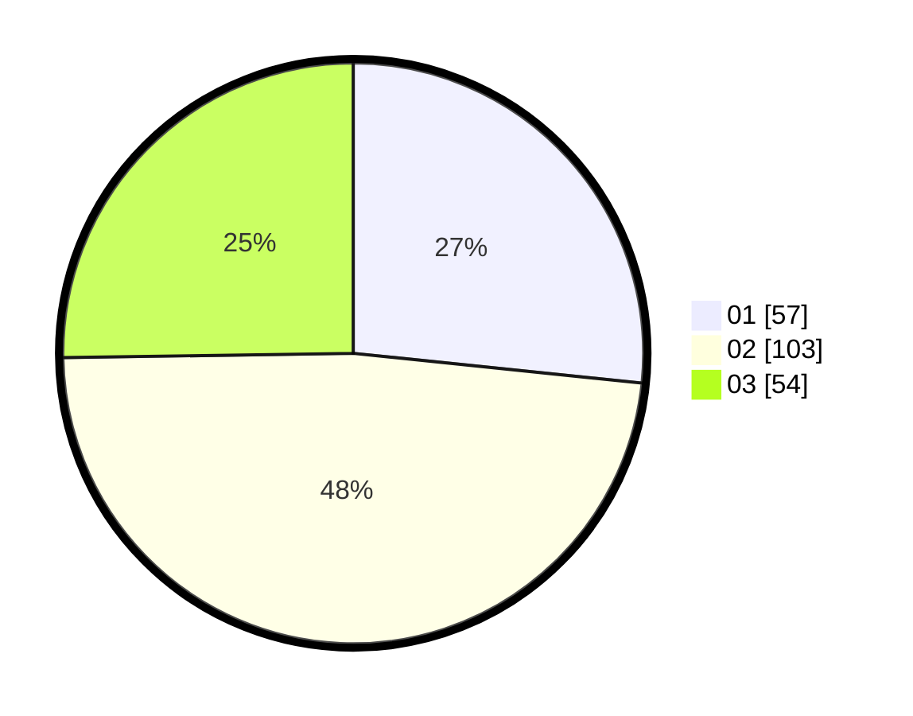

# Hasil

Hasil perolehan suara paslon dapat dilihat pada file paslon-01.txt, paslon-02.txt, dan paslon-03.txt.

Jika tidak ada, artinya data tersebut belum ada pada SIREKAP.

## Perolehan Suara

 * Paslon 01: **57**.
 * Paslon 02: **103**.
 * Paslon 03: **54**.

## Foto C Plano

https://sirekap-obj-formc.kpu.go.id/e702/pemilu/ppwp/31/73/06/10/05/3173061005132-20240214-232055--1d07424e-507d-4737-95cc-8d020a54307b.jpg

https://sirekap-obj-formc.kpu.go.id/e702/pemilu/ppwp/31/73/06/10/05/3173061005132-20240215-000653--7a7c93fa-61a9-4b2d-8d6c-dab9cfc4ff20.jpg

https://sirekap-obj-formc.kpu.go.id/e702/pemilu/ppwp/31/73/06/10/05/3173061005132-20240215-000734--10a3efeb-7b40-44ee-b286-b4dc6dcdda66.jpg
