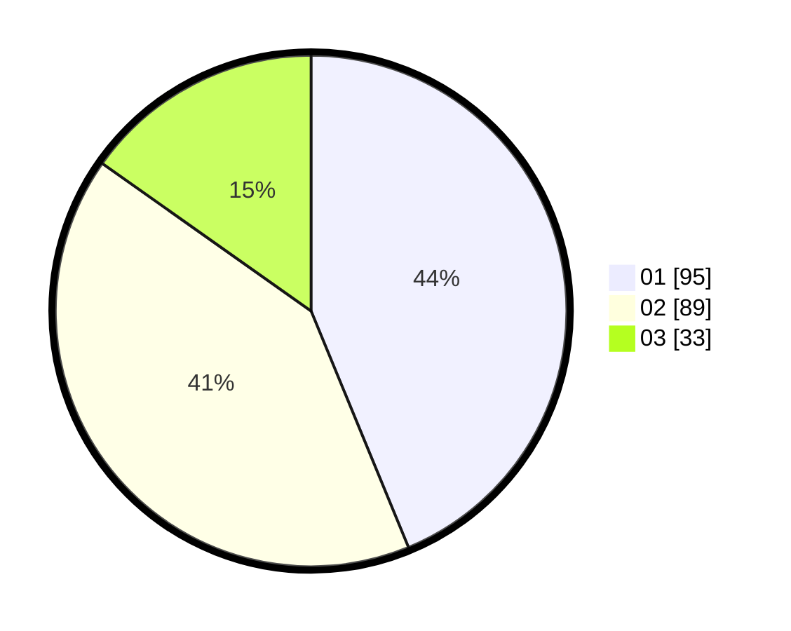

# Hasil

Hasil perolehan suara paslon dapat dilihat pada file paslon-01.txt, paslon-02.txt, dan paslon-03.txt.

Jika tidak ada, artinya data tersebut belum ada pada SIREKAP.

## Perolehan Suara

 * Paslon 01: **95**.
 * Paslon 02: **89**.
 * Paslon 03: **33**.

## Foto C Plano

https://sirekap-obj-formc.kpu.go.id/fa36/pemilu/ppwp/31/73/06/10/05/3173061005134-20240214-221635--a90beb87-25a1-457c-88ff-37ef64b61bfb.jpg

https://sirekap-obj-formc.kpu.go.id/fa36/pemilu/ppwp/31/73/06/10/05/3173061005134-20240214-195426--a66ed0a5-00bf-4296-8691-3ddbc557b2a0.jpg

https://sirekap-obj-formc.kpu.go.id/fa36/pemilu/ppwp/31/73/06/10/05/3173061005134-20240214-195546--9f0274bf-e1f1-4205-ac4a-51d1d2789713.jpg
