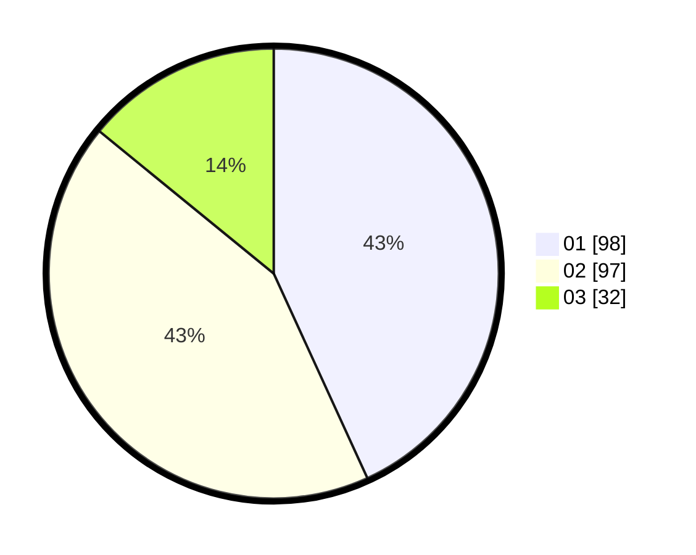

# Hasil

Hasil perolehan suara paslon dapat dilihat pada file paslon-01.txt, paslon-02.txt, dan paslon-03.txt.

Jika tidak ada, artinya data tersebut belum ada pada SIREKAP.

## Perolehan Suara

 * Paslon 01: **98**.
 * Paslon 02: **97**.
 * Paslon 03: **32**.

## Foto C Plano

https://sirekap-obj-formc.kpu.go.id/d2df/pemilu/ppwp/31/73/06/10/05/3173061005136-20240214-233132--dd07ac89-0dee-4928-9a33-5378bda2c664.jpg

https://sirekap-obj-formc.kpu.go.id/d2df/pemilu/ppwp/31/73/06/10/05/3173061005136-20240214-233241--f26c2c02-dc92-44ae-bba0-b4482780520b.jpg

https://sirekap-obj-formc.kpu.go.id/d2df/pemilu/ppwp/31/73/06/10/05/3173061005136-20240214-233356--0500bbd1-2d2d-4bda-905e-43f596c6725e.jpg
