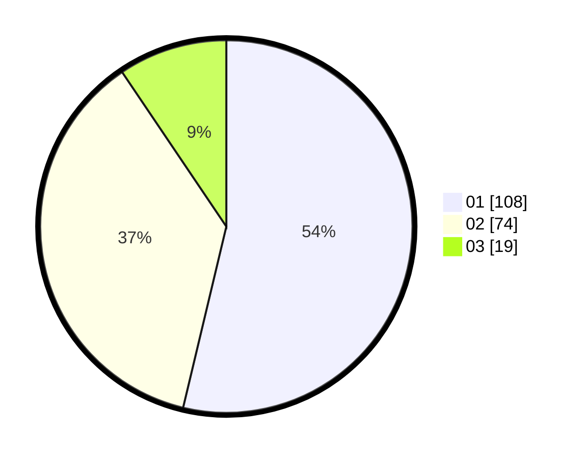

# Hasil

Hasil perolehan suara paslon dapat dilihat pada file paslon-01.txt, paslon-02.txt, dan paslon-03.txt.

Jika tidak ada, artinya data tersebut belum ada pada SIREKAP.

## Perolehan Suara

 * Paslon 01: **108**.
 * Paslon 02: **74**.
 * Paslon 03: **19**.

## Foto C Plano

https://sirekap-obj-formc.kpu.go.id/700b/pemilu/ppwp/31/73/06/10/05/3173061005140-20240215-001542--bec14dda-702f-4ef7-ba1d-859a695ee28b.jpg

https://sirekap-obj-formc.kpu.go.id/700b/pemilu/ppwp/31/73/06/10/05/3173061005140-20240215-001224--119137bf-d8d0-441e-b06e-8d6176767107.jpg

https://sirekap-obj-formc.kpu.go.id/700b/pemilu/ppwp/31/73/06/10/05/3173061005140-20240215-001809--5d888881-fc84-4d25-b733-a9dc364de5d5.jpg
