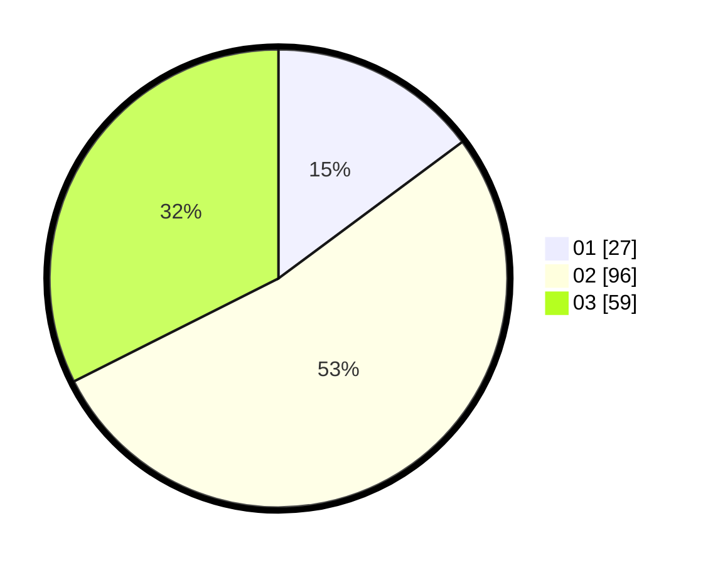

# Hasil

Hasil perolehan suara paslon dapat dilihat pada file paslon-01.txt, paslon-02.txt, dan paslon-03.txt.

Jika tidak ada, artinya data tersebut belum ada pada SIREKAP.

## Perolehan Suara

 * Paslon 01: **27**.
 * Paslon 02: **96**.
 * Paslon 03: **59**.

## Foto C Plano

https://sirekap-obj-formc.kpu.go.id/543b/pemilu/ppwp/31/73/06/10/05/3173061005145-20240214-190942--dea438f1-86d1-4d8d-bac7-0690342c8ecf.jpg

https://sirekap-obj-formc.kpu.go.id/543b/pemilu/ppwp/31/73/06/10/05/3173061005145-20240214-191156--87f9866b-df1d-40a1-a143-f1b9ad235de5.jpg

https://sirekap-obj-formc.kpu.go.id/543b/pemilu/ppwp/31/73/06/10/05/3173061005145-20240214-191324--bb3cfce5-996a-4ebe-b57a-87ba053bfe57.jpg

## DATA PEMILIH TETAP

Jumlah pemilih dalam DPT: **226**.
 * L: **100**.
 * P: **126**.

## DATA PENGGUNA HAK PILIH

Jumlah pengguna hak pilih dalam DPT: **179**.
 * L: **99**.
 * P: **80**.

Jumlah pengguna hak pilih dalam DPTb: **0**.
 * L: **0**.
 * P: **0**.

Jumlah pengguna hak pilih dalam DPK: **4**.
 * L: **1**.
 * P: **3**.

Jumlah pengguna hak pilih: **183**.
 * L: **100**.
 * P: **83**.

## JUMLAH SUARA SAH DAN TIDAK SAH

JUMLAH SELURUH SUARA SAH: **182**.

JUMLAH SUARA TIDAK SAH: **1**.

JUMLAH SELURUH SUARA SAH DAN SUARA TIDAK SAH: **183**.
