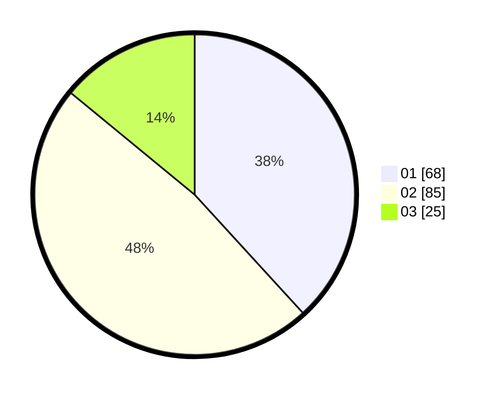

# Hasil

Hasil perolehan suara paslon dapat dilihat pada file paslon-01.txt, paslon-02.txt, dan paslon-03.txt.

Jika tidak ada, artinya data tersebut belum ada pada SIREKAP.

## Perolehan Suara

 * Paslon 01: **68**.
 * Paslon 02: **85**.
 * Paslon 03: **25**.

## Foto C Plano

https://sirekap-obj-formc.kpu.go.id/c680/pemilu/ppwp/31/73/06/10/05/3173061005147-20240214-201508--7ea2be66-c7be-4e00-9b40-b81c7548db3b.jpg

https://sirekap-obj-formc.kpu.go.id/c680/pemilu/ppwp/31/73/06/10/05/3173061005147-20240214-222639--da8f5594-ead3-4c9a-8713-4aebff5e8356.jpg

https://sirekap-obj-formc.kpu.go.id/c680/pemilu/ppwp/31/73/06/10/05/3173061005147-20240214-222712--f333d8dc-2420-414a-9e5a-c72e4087430c.jpg

## DATA PEMILIH TETAP

Jumlah pemilih dalam DPT: **209**.
 * L: **106**.
 * P: **103**.

## DATA PENGGUNA HAK PILIH

Jumlah pengguna hak pilih dalam DPT: **177**.
 * L: **91**.
 * P: **86**.

Jumlah pengguna hak pilih dalam DPTb: **0**.
 * L: **0**.
 * P: **0**.

Jumlah pengguna hak pilih dalam DPK: **5**.
 * L: **4**.
 * P: **1**.

Jumlah pengguna hak pilih: **182**.
 * L: **95**.
 * P: **87**.

## JUMLAH SUARA SAH DAN TIDAK SAH

JUMLAH SELURUH SUARA SAH: **178**.

JUMLAH SUARA TIDAK SAH: **4**.

JUMLAH SELURUH SUARA SAH DAN SUARA TIDAK SAH: **182**.
