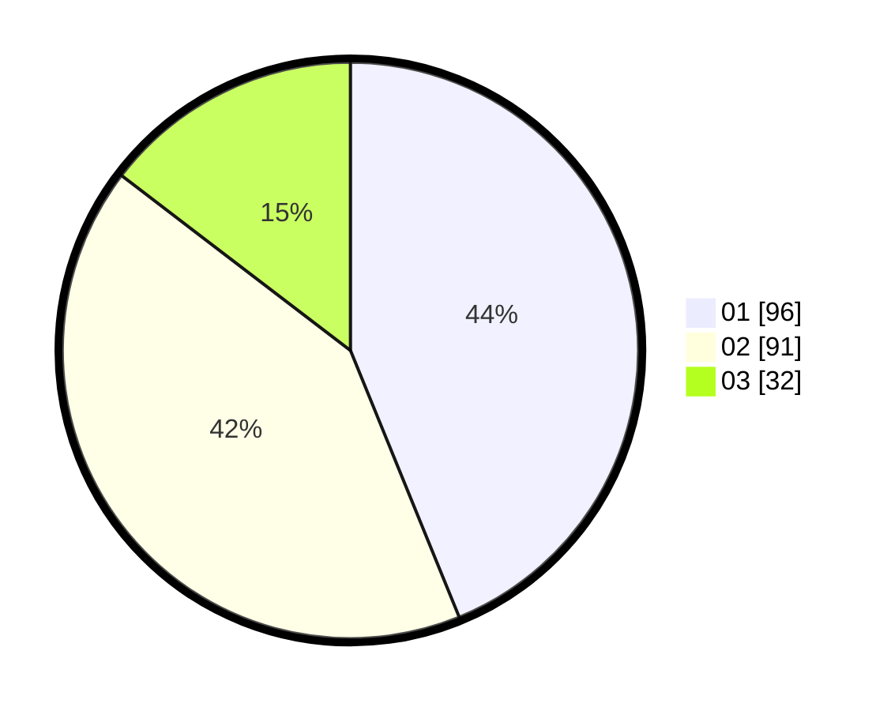

# Hasil

Hasil perolehan suara paslon dapat dilihat pada file paslon-01.txt, paslon-02.txt, dan paslon-03.txt.

Jika tidak ada, artinya data tersebut belum ada pada SIREKAP.

## Perolehan Suara

 * Paslon 01: **96**.
 * Paslon 02: **91**.
 * Paslon 03: **32**.

## Foto C Plano

https://sirekap-obj-formc.kpu.go.id/5ce5/pemilu/ppwp/31/73/06/10/05/3173061005148-20240214-224643--605f84ed-759e-4505-a2a8-21f3d17a033f.jpg

https://sirekap-obj-formc.kpu.go.id/5ce5/pemilu/ppwp/31/73/06/10/05/3173061005148-20240214-222202--7880c6d6-44f6-4dce-bc3f-140e6505d77e.jpg

https://sirekap-obj-formc.kpu.go.id/5ce5/pemilu/ppwp/31/73/06/10/05/3173061005148-20240214-222107--4382ebcd-3761-4759-985e-8f04c62bea23.jpg
