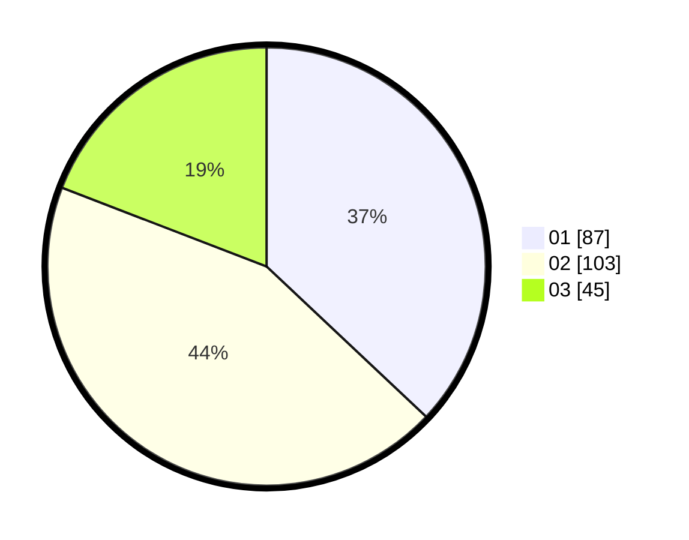

# Hasil

Hasil perolehan suara paslon dapat dilihat pada file paslon-01.txt, paslon-02.txt, dan paslon-03.txt.

Jika tidak ada, artinya data tersebut belum ada pada SIREKAP.

## Perolehan Suara

 * Paslon 01: **87**.
 * Paslon 02: **103**.
 * Paslon 03: **45**.

## Foto C Plano

https://sirekap-obj-formc.kpu.go.id/bcc6/pemilu/ppwp/31/73/06/10/05/3173061005169-20240214-230302--802704b5-f32b-4ba7-9105-9bb9c4949346.jpg

https://sirekap-obj-formc.kpu.go.id/bcc6/pemilu/ppwp/31/73/06/10/05/3173061005169-20240214-230309--b09362f1-057a-42de-93f0-48044a81e0df.jpg

https://sirekap-obj-formc.kpu.go.id/bcc6/pemilu/ppwp/31/73/06/10/05/3173061005169-20240214-230315--40ec99cb-9ddd-4bb8-9547-0814d6ad39f9.jpg
