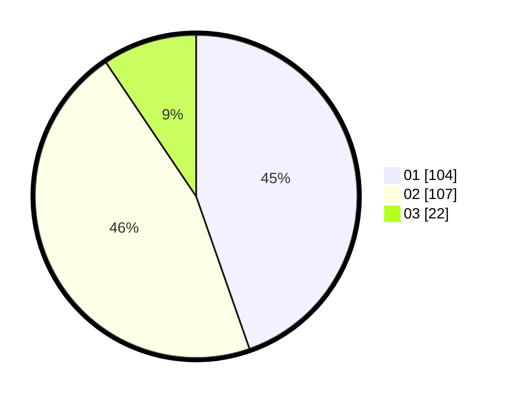

# Hasil

Hasil perolehan suara paslon dapat dilihat pada file paslon-01.txt, paslon-02.txt, dan paslon-03.txt.

Jika tidak ada, artinya data tersebut belum ada pada SIREKAP.

## Perolehan Suara

 * Paslon 01: **104**.
 * Paslon 02: **107**.
 * Paslon 03: **22**.

## Foto C Plano

https://sirekap-obj-formc.kpu.go.id/d7be/pemilu/ppwp/31/73/06/10/05/3173061005170-20240214-191414--408bdff4-eb8b-4f9e-bbb6-8eec45f2a66b.jpg

https://sirekap-obj-formc.kpu.go.id/d7be/pemilu/ppwp/31/73/06/10/05/3173061005170-20240214-191224--617ec988-13cd-4e87-9892-da5973487bc4.jpg

https://sirekap-obj-formc.kpu.go.id/d7be/pemilu/ppwp/31/73/06/10/05/3173061005170-20240214-191307--329f0484-9aa7-4c48-b8a3-15e7f7dd5906.jpg

## DATA PEMILIH TETAP

Jumlah pemilih dalam DPT: **299**.
 * L: **146**.
 * P: **153**.

## DATA PENGGUNA HAK PILIH

Jumlah pengguna hak pilih dalam DPT: **236**.
 * L: **113**.
 * P: **123**.

Jumlah pengguna hak pilih dalam DPTb: **2**.
 * L: **0**.
 * P: **2**.

Jumlah pengguna hak pilih dalam DPK: **0**.
 * L: **0**.
 * P: **0**.

Jumlah pengguna hak pilih: **238**.
 * L: **113**.
 * P: **125**.

## JUMLAH SUARA SAH DAN TIDAK SAH

JUMLAH SELURUH SUARA SAH: **233**.

JUMLAH SUARA TIDAK SAH: **5**.

JUMLAH SELURUH SUARA SAH DAN SUARA TIDAK SAH: **238**.
