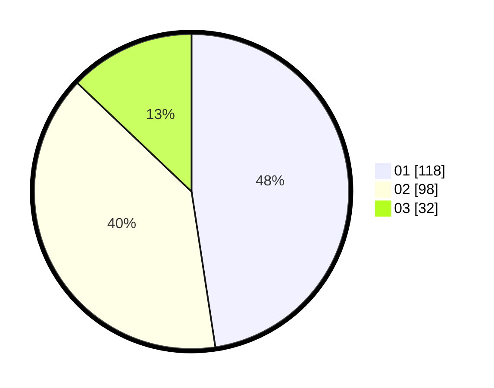

# Hasil

Hasil perolehan suara paslon dapat dilihat pada file paslon-01.txt, paslon-02.txt, dan paslon-03.txt.

Jika tidak ada, artinya data tersebut belum ada pada SIREKAP.

## Perolehan Suara

 * Paslon 01: **118**.
 * Paslon 02: **98**.
 * Paslon 03: **32**.

## Foto C Plano

https://sirekap-obj-formc.kpu.go.id/71ce/pemilu/ppwp/31/73/06/10/05/3173061005171-20240214-223008--0aa036bc-ec0c-411c-a5af-9953f96855e3.jpg

https://sirekap-obj-formc.kpu.go.id/71ce/pemilu/ppwp/31/73/06/10/05/3173061005171-20240214-222616--19f13448-d235-4ce9-8b37-7f25fff2c107.jpg

https://sirekap-obj-formc.kpu.go.id/71ce/pemilu/ppwp/31/73/06/10/05/3173061005171-20240214-222733--99dfbbab-c76a-4b50-b41b-3184292ffa34.jpg
