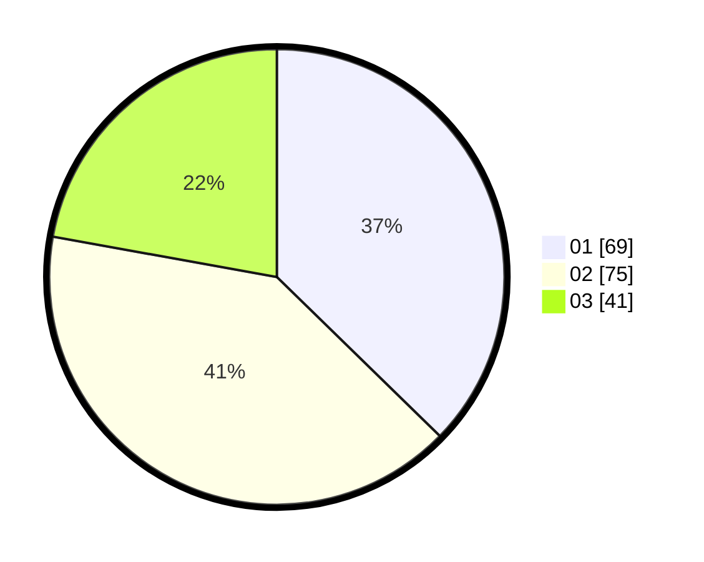

# Hasil

Hasil perolehan suara paslon dapat dilihat pada file paslon-01.txt, paslon-02.txt, dan paslon-03.txt.

Jika tidak ada, artinya data tersebut belum ada pada SIREKAP.

## Perolehan Suara

 * Paslon 01: **69**.
 * Paslon 02: **75**.
 * Paslon 03: **41**.

## Foto C Plano

https://sirekap-obj-formc.kpu.go.id/87b8/pemilu/ppwp/31/73/06/10/05/3173061005177-20240214-193600--0d3ebd89-70df-439e-a8e1-e5be7d5900af.jpg

https://sirekap-obj-formc.kpu.go.id/87b8/pemilu/ppwp/31/73/06/10/05/3173061005177-20240214-193722--110d4201-21bf-4e14-8bb6-5640071729e6.jpg

https://sirekap-obj-formc.kpu.go.id/87b8/pemilu/ppwp/31/73/06/10/05/3173061005177-20240214-193857--dcbdbb09-e0bf-45f2-89f9-920dcb5b427d.jpg
